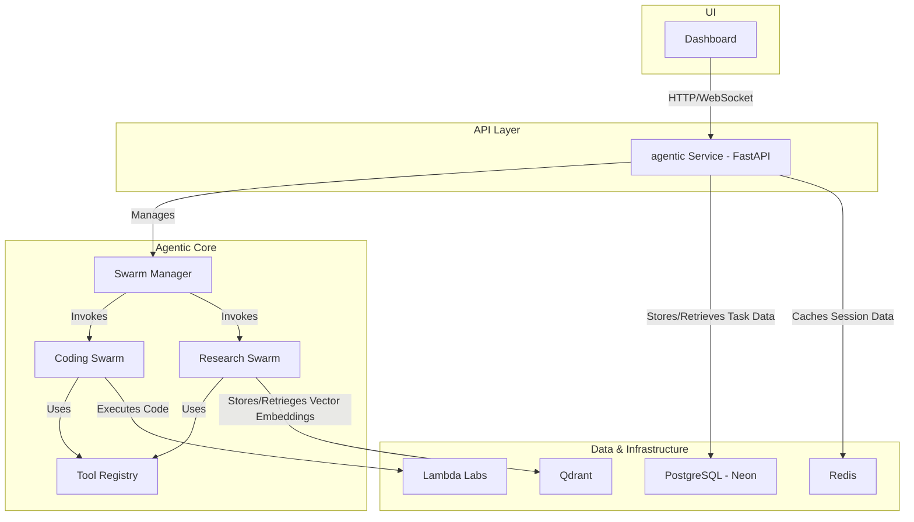

# Agno AI Integration Technical Plan

## 1. Introduction

This document outlines the comprehensive technical plan for integrating Agno AI into the `sophia-ai-intel` monorepo. The goal is to create a clean, maintainable, and robust system by consolidating existing services and establishing a unified architecture for all agentic capabilities.

## 2. Proposed Architecture

The new architecture will center around a single, unified Python-based service named `agentic`, located in the `services/` directory. This service will be built with FastAPI and will be responsible for all agent and swarm-related operations.

### 2.1. Architectural Diagram

### 2.2. Service Consolidation

*   **`agno-coordinator` (Node.js/TypeScript):** The core routing and swarm management logic will be ported to Python and integrated into the new `agentic` service. This service will then be deprecated and removed.
*   **`agno-teams` (Python/FastAPI):** The concepts of "teams" and "multi-agent collaboration" will be merged into the `agentic` service's swarm management system. This service will then be deprecated and removed.
*   **`agno-wrappers` (Python/FastAPI):** This service is deemed redundant and will be deprecated and removed. Any necessary integrations with other MCP services will be handled directly within the `agentic` service.

## 3. Implementation Phases

The project will be executed in the following phases, as detailed in the todo list:

### Phase 1: Consolidate Existing Services & Define Architecture

This phase focuses on designing the new `agentic` service and planning the migration from the legacy services. The key deliverables include the unified architecture design, ported routing logic, and the new data models.

### Phase 2: Implement Core Agentic Service

This phase focuses on the core implementation of the `agentic` service, including the Coding and Research swarms. The key deliverables include the FastAPI application, the implementation of the two swarms, and their respective tools.

### Phase 3: UI Integration & Deployment

This phase focuses on integrating the new `agentic` service with the frontend and establishing a CI/CD pipeline. The key deliverables include the API endpoints, the dashboard UI components, and the new CI/CD pipeline.

### Phase 4: Testing & Cleanup

This phase focuses on ensuring the quality of the new service and cleaning up the repository. The key deliverables include a comprehensive test suite and the removal of the legacy Agno services.

## 4. Data Management

*   **PostgreSQL (Neon):** Will be used to store relational data, such as agent configurations, task definitions, and execution logs.
*   **Redis:** Will be used for caching session data, managing task queues, and facilitating real-time communication.
*   **Qdrant:** Will be used by the Research Swarm to store and retrieve vector embeddings for semantic search and data analysis.

## 5. Next Steps

This plan will now be reviewed and approved. Once approved, development will begin on Phase 1.