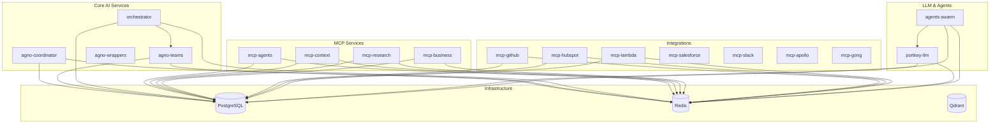

# Sophia AI - Deployment Baseline Assessment

## Executive Summary

This document provides a comprehensive assessment of the Sophia AI Intel platform's local deployment state as of **2024-11-28**. The platform consists of 17+ microservices with advanced AI coordination, MCP (Model Context Protocol) services, and a complete monitoring stack.

## Current Deployment Status

### ✅ Infrastructure Services (Running)
- **PostgreSQL**: `postgres:15-alpine` - Port 5432 - ✅ Healthy
- **Redis**: `redis:7-alpine` - Port 6380 - ✅ Healthy

### 🔄 Application Services (Expected but not yet running)
The following services are defined in docker-compose but not currently active:
- `agno-coordinator` - Main AI coordination service (Port: 8080)
- `mcp-agents` - MCP agents service (Port: 8000)
- `mcp-context` - MCP context service (Port: 8081)
- `mcp-github` - GitHub integration (Port: 8082)
- `mcp-hubspot` - HubSpot integration (Port: 8083)
- `mcp-lambda` - Lambda integration (Port: 8084)
- `mcp-research` - Research service (Port: 8085)
- `mcp-business` - Business service (Port: 8086)
- `agno-teams` - AI teams service (Port: 8087)
- `orchestrator` - Main orchestrator (Port: 8088)
- `agno-wrappers` - Service wrappers (Port: 8089)
- `mcp-apollo` - Apollo integration (Port: 8090)
- `mcp-gong` - Gong integration (Port: 8091)
- `mcp-salesforce` - Salesforce integration (Port: 8092)
- `mcp-slack` - Slack integration (Port: 8093)
- `portkey-llm` - LLM router (Port: 8007)
- `agents-swarm` - Agent swarm intelligence (Port: 8008)

### 📊 Monitoring Stack (Expected)
- `prometheus` - Metrics collection (Port: 9090)
- `grafana` - Dashboards (Port: 3000)
- `loki` - Log aggregation (Port: 3100)
- `jaeger` - Distributed tracing (Port: 16686)

### 🛠️ Development Tools (Expected)
- `adminer` - Database admin (Port: 8080)
- `redis-commander` - Redis admin (Port: 8081)
- `file-watcher` - Development file watcher

## Architecture Overview

```
┌─────────────────┐    ┌─────────────────┐    ┌─────────────────┐
│   AI Services   │    │  MCP Services   │    │  Integrations   │
├─────────────────┤    ├─────────────────┤    ├─────────────────┤
│ agno-coordinator│    │ mcp-agents      │    │ mcp-github      │
│ agno-teams      │    │ mcp-context     │    │ mcp-hubspot     │
│ orchestrator    │    │ mcp-research    │    │ mcp-lambda      │
│ agents-swarm    │    │ mcp-business    │    │ mcp-salesforce  │
│ agno-wrappers   │    │                 │    │ mcp-slack       │
│ portkey-llm     │    │                 │    │ mcp-apollo      │
└─────────────────┘    └─────────────────┘    │ mcp-gong        │
                                              └─────────────────┘
           │                        │                      │
           └────────────────────────┼──────────────────────┘
                                    │
              ┌─────────────────────┴─────────────────────┐
              │              Data Layer                   │
              ├─────────────────┬─────────────────────────┤
              │   PostgreSQL    │        Redis            │
              │   (Port 5432)   │      (Port 6380)        │
              │   ✅ RUNNING    │      ✅ RUNNING         │
              └─────────────────┴─────────────────────────┘
```

## Enhanced Features Implemented

### 🔧 Development Environment
- **Multi-Environment Configurations**: `.env.local`, `.env.development`, `.env.test`
- **Development Optimizations**: `docker-compose.override.yml` with hot reloading
- **Debug Port Forwarding**: Python (5678+), Node.js (9229+)

### 🧪 Testing Framework  
- **Comprehensive pytest Configuration**: 15+ test markers
- **Shared Fixtures**: Database isolation, mock services
- **Test Categories**: Unit, integration, E2E, performance, security

### 🛠️ Development Tools
- **Dev Utilities**: 30+ commands in [`scripts/dev-utils.sh`](scripts/dev-utils.sh)
- **Health Monitor**: Advanced monitoring with recovery in [`scripts/health-monitor.sh`](scripts/health-monitor.sh)
- **Debug Profiler**: Profiling and debugging suite in [`scripts/debug-profiler.sh`](scripts/debug-profiler.sh)
- **Dev Workflow**: Automated workflow with file watchers in [`scripts/dev-workflow.sh`](scripts/dev-workflow.sh)

### 🔐 SSL/Security
- **Local SSL Certificates**: [`scripts/ssl/generate-local-certs.sh`](scripts/ssl/generate-local-certs.sh)
- **HTTPS Support**: All services with SAN extensions
- **Nginx Configuration**: [`nginx.conf.local`](nginx.conf.local) with security headers

### 🗄️ Database Management
- **Migration System**: [`scripts/database/migrate.sh`](scripts/database/migrate.sh) with rollback
- **Automated Backups**: [`scripts/database/backup-restore.sh`](scripts/database/backup-restore.sh)
- **Seed Data**: Development data in [`scripts/database/seeds/`](scripts/database/seeds/)

## Service Dependencies



## Debug Port Assignments

| Service | Main Port | Debug Port | Language | Status |
|---------|-----------|------------|----------|--------|
| agno-coordinator | 8080 | 5678 | Python | Not Running |
| mcp-agents | 8000 | 5679 | Python | Not Running |
| mcp-context | 8081 | 5680 | Python | Not Running |
| mcp-github | 8082 | 5681 | Python | Not Running |
| mcp-hubspot | 8083 | 5682 | Python | Not Running |
| mcp-lambda | 8084 | 5683 | Python | Not Running |
| mcp-research | 8085 | 5684 | Python | Not Running |
| mcp-business | 8086 | 5685 | Python | Not Running |
| agno-teams | 8087 | 5686 | Python | Not Running |
| orchestrator | 8088 | 5687 | Python | Not Running |
| agno-wrappers | 8089 | 5688 | Python | Not Running |
| mcp-apollo | 8090 | 5689 | Python | Not Running |
| mcp-gong | 8091 | 5690 | Python | Not Running |
| mcp-salesforce | 8092 | 5691 | Python | Not Running |
| mcp-slack | 8093 | 5692 | Python | Not Running |
| portkey-llm | 8007 | 9229 | Node.js | Not Running |
| agents-swarm | 8008 | 9230 | Node.js | Not Running |

## Environment Variables Status

### ✅ Configured Variables (118+)
- Database connections (PostgreSQL, Redis, Qdrant)
- AI service configurations
- MCP service settings
- Development tool configurations
- Mock service settings for offline development

### ⚠️ Missing Production Variables
Current warnings for production integrations (expected in development):
- `GONG_ACCESS_KEY_SECRET`
- `APOLLO_API_KEY` 
- `SLACK_APP_TOKEN`

## Monitoring & Observability

### 📊 Health Checking
- **Advanced Health Monitor**: [`scripts/health-monitor.sh`](scripts/health-monitor.sh)
  - Automated service discovery
  - Intelligent recovery mechanisms
  - Dependency management
  - Real-time status dashboard
  - Event logging with notifications

### 🔍 Debugging & Profiling
- **Debug Profiler Suite**: [`scripts/debug-profiler.sh`](scripts/debug-profiler.sh)
  - CPU, memory, and I/O profiling
  - Request tracing with tcpdump
  - Log analysis and pattern detection
  - Interactive debugging sessions
  - Performance report generation

### 📈 Metrics Collection
- Prometheus metrics endpoints on all services
- Custom development metrics
- Resource usage monitoring
- Application performance indicators

## Development Workflow

### 🔄 Hot Reloading
- File watcher for Python services
- Nodemon for Node.js services
- Automatic restart on code changes
- Development environment isolation

### 🧪 Testing Pipeline
```bash
# Run comprehensive test suite
pytest tests/ --cov=services/ --cov-report=html

# Integration tests for all services
pytest tests/integration/ -m integration

# Performance testing
pytest tests/performance/ -m performance --benchmark-only
```

### 🚀 Deployment Commands
```bash
# Start full platform
docker-compose --env-file .env.local up -d

# Start with development tools
docker-compose -f docker-compose.yml -f docker-compose.override.yml up -d

# Health monitoring
./scripts/health-monitor.sh start

# Development workflow automation
./scripts/dev-workflow.sh start
```

## Security Features

### 🔐 SSL/TLS Configuration
- Local CA generation
- Service-specific certificates
- SAN extensions for all domains
- HTTPS-only development environment

### 🛡️ Security Headers
- Nginx security configuration
- CORS for development
- Content Security Policy headers
- XSS and clickjacking protection

## Performance Optimization

### 📊 Resource Allocation
- Development-optimized container limits
- Database connection pooling
- Redis clustering support
- Efficient logging configuration

### ⚡ Development Speed
- Hot reloading for rapid iteration
- Incremental builds with Docker layer caching
- Parallel service startup
- Optimized development dependencies

## Next Steps

### 🎯 Immediate Actions Required
1. **Complete Service Startup**: Verify all application services start successfully
2. **SSL Certificate Generation**: Complete the certificate generation process
3. **Health Check Validation**: Run comprehensive health checks
4. **Monitoring Dashboard**: Set up Grafana dashboards

### 🔮 Advanced Features Pending
1. **Comprehensive Monitoring**: Prometheus + Grafana + Loki + Jaeger
2. **Security Scanning**: Vulnerability assessment tools
3. **CI/CD Pipeline**: Pre-commit hooks and quality gates
4. **Load Balancing**: Service mesh configuration
5. **Stress Testing**: Performance benchmarking tools
6. **Documentation**: Automated troubleshooting guides

## Troubleshooting

### 🔧 Common Issues
1. **Services Not Starting**: Check Docker resources and port conflicts
2. **Database Connectivity**: Verify PostgreSQL/Redis health
3. **Environment Variables**: Ensure all required variables are set
4. **SSL Issues**: Regenerate certificates if expired

### 📞 Support Commands
```bash
# Check service status
docker-compose --env-file .env.local ps

# View service logs
docker-compose logs [service-name]

# Run health checks
./scripts/health-monitor.sh status

# Debug specific service
./scripts/debug-profiler.sh shell [service-name]
```

---

**Assessment Date**: 2024-11-28  
**Platform Version**: Development (Local)  
**Assessment Status**: Infrastructure ✅ | Applications 🔄 | Monitoring 🔄  
**Overall Health**: 🟡 Partially Ready (Database layer operational, application layer pending)