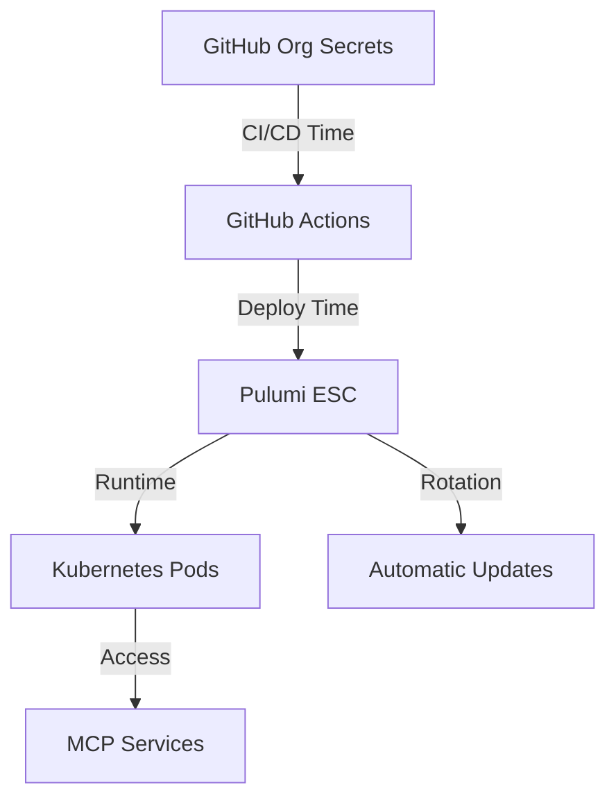

# Sophia AI Intel - Smart Secrets Management

## Recommended Approach: GitHub + Pulumi ESC Hybrid

### Architecture Overview



### Implementation Plan

#### 1. GitHub Organization Secrets (Deployment Layer)
```yaml
# Store in GitHub Org Settings:
Infrastructure:
  - PULUMI_ACCESS_TOKEN
  - LAMBDA_API_KEY
  - DOCKERHUB_TOKEN
  - DNSIMPLE_API_TOKEN

# Why: These rarely change, needed for deployment
```

#### 2. Pulumi ESC (Runtime Layer)
```typescript
// pulumi/environments/production.yaml
values:
  # Database connections
  database:
    url: 
      fn::secret: ${neon.connectionString}
    
  # API Keys that rotate
  openai:
    key:
      fn::secret:
        ciphertext: ${encrypted_openai_key}
        
  # Service-specific configs
  mcp:
    research:
      serpapi: ${secrets.serpapi}
      perplexity: ${secrets.perplexity}
```

#### 3. Kubernetes Integration
```yaml
# Automatic secret injection
apiVersion: v1
kind: Secret
metadata:
  name: sophia-secrets
  annotations:
    pulumi.com/esc-environment: "ai-cherry/production"
type: Opaque
```

### Cool Features

1. **Zero-Touch Rotation**
   ```bash
   # Rotate a secret
   pulumi config set --secret openai-key "new-key-value"
   # Pods automatically restart with new value
   ```

2. **Environment Branching**
   ```bash
   # Dev gets different secrets automatically
   pulumi stack select dev
   pulumi up  # Uses dev secrets
   ```

3. **Audit Trail**
   - GitHub: Who deployed what
   - Pulumi: Who accessed which secret when
   - Kubernetes: Which pod used what

### Implementation Steps

1. **Today**: Move critical secrets to GitHub Org
2. **Tomorrow**: Set up Pulumi ESC environments
3. **This Week**: Update services to read from env vars only
4. **Next Week**: Implement automatic rotation

### Service Configuration

```python
# services/mcp-*/app.py
import os
from pulumi_kubernetes.core.v1 import EnvVarArgs

# Clean, simple, secure
OPENAI_API_KEY = os.environ["OPENAI_API_KEY"]
DATABASE_URL = os.environ["DATABASE_URL"]

# No more .env files in production!
```

### Why This Doesn't Suck

- **Not Overkill**: Uses tools you already have
- **Developer Friendly**: `pulumi up` and done
- **Secure**: Encrypted at rest, in transit, in memory
- **Auditable**: Complete trail of who/what/when
- **Scalable**: Works for 1 or 1000 services
