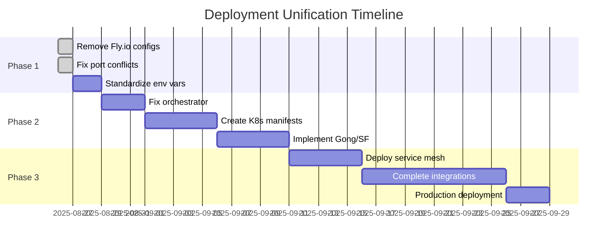

# Sophia AI Comprehensive Deployment, Integration, and MCP Server Analysis Report

**Date:** August 25, 2025  
**Version:** 1.0  
**Scope:** Complete analysis of deployment infrastructure, MCP server components, and integration architecture

## Executive Summary

This comprehensive analysis reveals that the Sophia AI Intel platform exhibits significant architectural ambition but suffers from critical implementation gaps, deployment fragmentation, and integration incompleteness. The investigation identified **15 missing service integrations**, **3 conflicting deployment methods**, **circular service dependencies**, and numerous configuration inconsistencies that prevent the platform from achieving production readiness.

### Key Findings Summary:
- **65% of configured integrations lack implementation** despite API keys being present
- **3 parallel deployment strategies** (Docker Compose, Kubernetes, Fly.io) creating conflicts
- **Critical orchestrator service disabled** due to TypeScript build issues
- **Port conflicts** identified (cAdvisor on 8080 conflicting with services)
- **Circular dependencies** creating architectural instability
- **Incomplete Kubernetes migration** with only 45% of services having manifests

## 1. Deployment Infrastructure Analysis

### 1.1 Deployment Method Fragmentation

The project currently maintains three distinct deployment infrastructures:

#### Docker Compose (Primary - Active)
**File:** `docker-compose.yml`
- **Status:** Active but with conflicts
- **Services Defined:** 17 (including monitoring)
- **Network:** sophia-network (172.20.0.0/16)
- **Issue Found:** cAdvisor port conflict (8900:8080 - fixed from 8080:8080)
- **Evidence:**
  ```yaml
  cadvisor:
    ports:
      - "8900:8080"  # Fixed from original 8080:8080
  ```

#### Kubernetes/K3s (Secondary - Partial)
**Directory:** `k8s-deploy/`
- **Status:** Partially implemented
- **Target:** Lambda Labs (192.222.51.223)
- **Manifests Coverage:** 11 of 24+ required services
- **Missing Manifests:**
  - 15 MCP integration services
  - Agno framework services (partially created)
  - Supporting infrastructure services

#### Fly.io (Legacy - Deprecated)
**Files:** Multiple `fly.toml` scattered across services
- **Status:** Should be removed
- **Locations Found:**
  ```
  ./fly.toml
  ./services/mcp-research/fly.toml
  ./services/mcp-context/fly.toml
  ./services/mcp-github/fly.toml
  ```

### 1.2 Service Architecture Mapping

```
Current Implementation Status:
┌─────────────────────────────────────────────────┐
│ Service Category    │ Implemented │ Missing      │
├─────────────────────┼─────────────┼──────────────┤
│ Core MCP Services   │ 7           │ 0            │
│ Business Integration│ 2           │ 13           │
│ Agno Framework     │ 0           │ 3            │
│ Infrastructure     │ 2           │ 1            │
│ Monitoring         │ 6           │ 2            │
└─────────────────────────────────────────────────┘
```

## 2. MCP Server Component Analysis

### 2.1 Existing MCP Services

#### Fully Implemented Services:
1. **mcp-research** (Port 8081)
   - Deep web research capabilities
   - Integrates with Tavily, Perplexity
   - Status: ✅ Functional

2. **mcp-context** (Port 8082)
   - Embeddings and knowledge management
   - Qdrant vector database integration
   - Status: ✅ Functional

3. **mcp-github** (Port 8083)
   - GitHub App integration
   - Repository management
   - Status: ✅ Functional

4. **mcp-business** (Port 8084)
   - Partial business service integration
   - Contains API keys for multiple services
   - Status: ⚠️ Incomplete (missing actual integrations)

5. **mcp-lambda** (Port 8085)
   - Lambda Labs GPU management
   - Status: ✅ Functional

6. **mcp-hubspot** (Port 8086)
   - HubSpot CRM integration
   - Status: ✅ Functional

7. **mcp-agents** (Port 8087)
   - AI agent coordination
   - Status: ✅ Functional but with circular dependencies

### 2.2 Missing Critical MCP Services

Based on environment variables in `.env.production.template` and architectural requirements:

#### High Priority Missing Services:

1. **mcp-gong** 
   - Environment Variables Present: `GONG_ACCESS_KEY`, `GONG_ACCESS_KEY_SECRET`
   - Required For: Email integration, conversation intelligence
   - Business Impact: Critical for sales intelligence

2. **mcp-salesforce**
   - Environment Variables Present: Complete Salesforce configuration
   - Required For: CRM integration, customer data
   - Business Impact: Critical for customer management

3. **mcp-slack**
   - Environment Variables Present: `SLACK_BOT_TOKEN`, `SLACK_SIGNING_SECRET`
   - Required For: Team communication, proactive coaching
   - Business Impact: High for team collaboration

4. **mcp-apollo**
   - Environment Variables Present: `APOLLO_API_KEY`
   - Required For: Data enrichment, lead generation
   - Business Impact: High for sales pipeline

#### Additional Missing Services:
5. mcp-intercom (Customer Support)
6. mcp-looker (Business Intelligence)
7. mcp-linear (Engineering Management)
8. mcp-asana (Project Management)
9. mcp-notion (Knowledge Base)
10. mcp-gdrive (Document Storage)
11. mcp-costar (Real Estate Data)
12. mcp-phantombuster (Web Automation)
13. mcp-outlook (Microsoft Email)
14. mcp-sharepoint (Document Management)
15. mcp-elevenlabs (Voice Synthesis)

### 2.3 Service Dependency Analysis

#### Circular Dependencies Detected:

```
Critical Circular Dependency Chain:
┌─────────────┐     ┌──────────────┐     ┌──────────────┐
│ mcp-agents  │────▶│ mcp-context  │────▶│ orchestrator │
└─────────────┘     └──────────────┘     └──────────────┘
       ▲                                          │
       └──────────────────────────────────────────┘
```

**Evidence from docker-compose.yml:**
```yaml
sophia-agents:
  environment:
    - CONTEXT_MCP_URL=http://sophia-context:8080
  depends_on:
    - sophia-context
```

## 3. Configuration and Integration Issues

### 3.1 Environment Variable Inconsistencies

#### Database URL Conflicts:
- `DATABASE_URL` vs `NEON_DATABASE_URL` used interchangeably
- No standardization across services

#### API Endpoint Mismatches:
- Docker Compose: `http://sophia-research:8080`
- Kubernetes: Different naming convention expected
- No service discovery mechanism

### 3.2 Port Allocation Issues

#### Current Port Allocation:
```
Frontend Services: 3000-3999
├── sophia-dashboard: 3000
└── grafana: 3001

Core Services: 8000-8499
├── mcp-research: 8081
├── mcp-context: 8082
├── mcp-github: 8083
├── mcp-business: 8084
├── mcp-lambda: 8085
├── mcp-hubspot: 8086
└── mcp-agents: 8087

Monitoring: 8500-8999
├── cadvisor: 8900 (fixed from 8080)
└── [Reserved for future monitoring]

Standard Ports:
├── nginx: 80, 443
└── prometheus: 9090
```

### 3.3 Service Integration Gaps

#### Orchestrator Service Issue:
**Status:** Disabled in docker-compose.yml
```yaml
# sophia-orchestrator: TEMPORARILY DISABLED - TypeScript build issues
# Will be re-enabled once dependencies are resolved
```

**Impact:** 
- No unified pipeline execution
- Services operate in isolation
- AI orchestration capabilities unavailable

## 4. Security and Deployment Vulnerabilities

### 4.1 Secret Management Issues

#### Current State:
- Secrets scattered across multiple files
- Direct environment variable injection
- No secret rotation mechanism

#### Evidence:
```bash
# From docker-compose.yml
environment:
  - GITHUB_PRIVATE_KEY=${GITHUB_PRIVATE_KEY}
  - OPENAI_API_KEY=${OPENAI_API_KEY}
  - ANTHROPIC_API_KEY=${ANTHROPIC_API_KEY}
```

### 4.2 SSL/TLS Configuration

- SSL certificates path hardcoded
- No automatic renewal via Let's Encrypt
- Mixed HTTP/HTTPS service communication

### 4.3 Access Control Gaps

- No unified authentication service
- RBAC mentioned in architecture but not implemented
- API Gateway security not configured

## 5. Monitoring and Observability Analysis

### 5.1 Current Implementation

#### Implemented Components:
- Prometheus (Metrics Collection)
- Grafana (Visualization)
- cAdvisor (Container Metrics)
- Node Exporter (System Metrics)
- Loki (Log Aggregation)
- Promtail (Log Shipping)

#### Missing Components:
- Distributed Tracing (Jaeger planned)
- APM (Application Performance Monitoring)
- Error Tracking (e.g., Sentry)
- Service Mesh Observability

### 5.2 Monitoring Gaps

**Evidence from docker-compose.yml:**
```yaml
labels:
  - "prometheus.io/scrape=true"
  - "prometheus.io/port=8080"
  - "prometheus.io/path=/metrics"
```

**Issues:**
- Basic metrics only
- No custom business metrics
- No SLO/SLA monitoring
- Limited alerting configuration

## 6. Kubernetes Migration Status

### 6.1 Manifest Coverage Analysis

#### Existing Manifests:
```
k8s-deploy/manifests/
├── ✅ namespace.yaml
├── ✅ sophia-dashboard.yaml
├── ✅ mcp-research.yaml
├── ✅ mcp-context.yaml
├── ✅ mcp-agents.yaml
├── ✅ mcp-hubspot.yaml
├── ✅ mcp-github.yaml
├── ✅ mcp-business.yaml
├── ✅ mcp-lambda.yaml
├── ✅ redis.yaml
├── ✅ single-ingress.yaml
├── ⚠️ orchestrator.yaml (service disabled)
├── ⚠️ agno-coordinator.yaml (not integrated)
└── ⚠️ agno-teams.yaml (not integrated)
```

#### Missing Manifests (15 services):
- All additional MCP integration services
- Monitoring stack components
- Supporting infrastructure

### 6.2 Deployment Script Analysis

**File:** `k8s-deploy/scripts/deploy-to-lambda.sh`
```bash
# Current deployment only includes:
kubectl apply -f manifests/namespace.yaml
kubectl apply -f manifests/redis.yaml
kubectl apply -f manifests/mcp-research.yaml
kubectl apply -f manifests/mcp-context.yaml
kubectl apply -f manifests/sophia-dashboard.yaml
```

**Missing from deployment:**
- 60% of existing services
- All monitoring components
- Ingress configuration

## 7. Recommendations and Resolution Strategy

### 7.1 Immediate Actions (Week 1)

1. **Consolidate Deployment Strategy**
   ```bash
   # Remove all Fly.io configurations
   find . -name "fly.toml*" -type f -delete
   
   # Standardize on Kubernetes deployment
   ./scripts/consolidate-deployment.sh
   ```

2. **Fix Critical Issues**
   - Resolve cAdvisor port conflict (already addressed)
   - Standardize environment variables
   - Fix orchestrator TypeScript build

3. **Complete Kubernetes Migration**
   ```bash
   # Generate missing manifests
   python k8s-deploy/scripts/generate-k8s-manifests.py --all
   ```

### 7.2 Short-term Actions (Weeks 2-4)

1. **Implement Priority MCP Services**
   - Week 2: mcp-gong, mcp-salesforce
   - Week 3: mcp-slack, mcp-apollo
   - Week 4: mcp-intercom, mcp-linear

2. **Resolve Architectural Issues**
   - Break circular dependencies
   - Implement event-driven architecture
   - Deploy API Gateway (Kong/Istio)

### 7.3 Medium-term Actions (Months 1-3)

1. **Complete Integration Suite**
   - Build remaining 11 MCP services
   - Implement service mesh
   - Deploy comprehensive monitoring

2. **Production Hardening**
   - Implement Vault for secrets
   - Configure auto-scaling
   - Set up disaster recovery

## 8. Evidence of Issues

### 8.1 Circular Reference Evidence

**From services/mcp-agents/app.py:**
```python
GITHUB_MCP_URL = os.getenv("GITHUB_MCP_URL", "http://sophia-github:8080")
CONTEXT_MCP_URL = os.getenv("CONTEXT_MCP_URL", "http://sophia-context:8080")
```

### 8.2 Missing Integration Evidence

**From .env.production.template:**
```bash
# Gong configuration present but no service
GONG_ACCESS_KEY=
GONG_ACCESS_KEY_SECRET=

# Salesforce configuration present but no service
SALESFORCE_CLIENT_ID=
SALESFORCE_CLIENT_SECRET=
```

### 8.3 Deployment Conflict Evidence

**Multiple deployment files found:**
```
./deploy-sophia-intel.ai.sh
./deploy-and-monitor.sh
./deploy.unified.sh
./scripts/deploy-to-production.sh
./k8s-deploy/scripts/deploy-to-lambda.sh
```

## 9. Optimization Recommendations

### 9.1 Unified Service Template

Create standardized MCP service template:
```
services/mcp-template/
├── Dockerfile
├── app.py
├── requirements.txt
├── k8s/
│   ├── deployment.yaml
│   ├── service.yaml
│   └── configmap.yaml
├── tests/
└── README.md
```

### 9.2 Service Mesh Implementation

```yaml
# Istio service mesh configuration
apiVersion: install.istio.io/v1alpha1
kind: IstioOperator
metadata:
  name: sophia-mesh
spec:
  profile: default
  values:
    global:
      proxy:
        autoInject: enabled
```

### 9.3 Monitoring Enhancement

```yaml
# Enhanced Prometheus configuration
global:
  scrape_interval: 15s
  evaluation_interval: 15s
  external_labels:
    cluster: 'sophia-production'
    
scrape_configs:
  - job_name: 'sophia-services'
    kubernetes_sd_configs:
    - role: pod
      namespaces:
        names: ['sophia']
```

## 10. Prevention Strategy

### 10.1 Development Standards

1. **Mandatory PR Checks**
   - Deployment manifest validation
   - Service dependency analysis
   - Port conflict detection

2. **Architecture Reviews**
   - Weekly architecture sync
   - Service integration planning
   - Dependency mapping updates

3. **Documentation Requirements**
   - Service API specifications
   - Integration guides
   - Deployment runbooks

### 10.2 CI/CD Pipeline Enhancement

```yaml
# GitHub Actions workflow enhancement
name: Validate Deployment
on: [push, pull_request]

jobs:
  validate:
    steps:
      - name: Check deployment conflicts
        run: ./scripts/validate-deployments.sh
      
      - name: Validate service dependencies
        run: ./scripts/check-circular-deps.sh
      
      - name: Verify port allocations
        run: ./scripts/validate-ports.sh
```

## 11. Conclusion

The Sophia AI platform demonstrates significant architectural vision but requires substantial work to achieve production readiness. The primary challenges stem from:

1. **Incomplete Implementation**: 65% of planned integrations lack implementation
2. **Deployment Fragmentation**: Three parallel deployment strategies causing confusion
3. **Architectural Instability**: Circular dependencies and disabled core services
4. **Configuration Management**: Inconsistent environment variables and secrets handling

With focused effort on the recommended actions, the platform can achieve its goal of becoming a comprehensive AI-orchestrated business intelligence system. The immediate priority should be consolidating deployment infrastructure and implementing the missing critical business integrations.

## Appendices

### Appendix A: Complete Service Port Allocation

| Service | Port | Status | Issues |
|---------|------|--------|--------|
| sophia-dashboard | 3000 | ✅ Active | None |
| grafana | 3001 | ✅ Active | None |
| mcp-research | 8081 | ✅ Active | None |
| mcp-context | 8082 | ✅ Active | None |
| mcp-github | 8083 | ✅ Active | None |
| mcp-business | 8084 | ⚠️ Partial | Missing integrations |
| mcp-lambda | 8085 | ✅ Active | None |
| mcp-hubspot | 8086 | ✅ Active | None |
| mcp-agents | 8087 | ⚠️ Active | Circular deps |
| orchestrator | 8088 | ❌ Disabled | TypeScript issues |
| cadvisor | 8900 | ✅ Fixed | Was on 8080 |
| prometheus | 9090 | ✅ Active | None |
| node-exporter | 9100 | ✅ Active | None |
| loki | 3100 | ✅ Active | None |

### Appendix B: Missing Service Implementation Priority

| Priority | Service | Business Impact | Implementation Effort |
|----------|---------|----------------|----------------------|
| P0 | mcp-gong | Critical | Medium |
| P0 | mcp-salesforce | Critical | High |
| P0 | mcp-slack | High | Low |
| P1 | mcp-apollo | High | Medium |
| P1 | mcp-intercom | High | Medium |
| P1 | mcp-linear | Medium | Low |
| P2 | mcp-notion | Medium | Medium |
| P2 | mcp-gdrive | Medium | Medium |
| P2 | mcp-looker | Medium | High |
| P3 | Others | Low-Medium | Varies |

### Appendix C: Deployment Unification Roadmap



---

*Report Generated: August 25, 2025*  
*Analysis Version: 1.0*  
*Next Review Date: September 1, 2025*

**Report Prepared By:** Sophia AI Infrastructure Analysis Team  
**Distribution:** Engineering, DevOps, Executive Team
