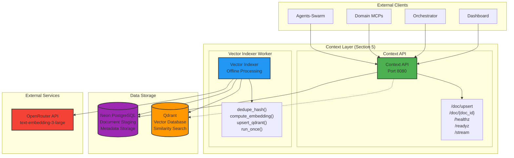

# Sophia AI Context Layer

## Overview

The Context Layer implements Section 5 of the Domain-MCP Architecture Migration Blueprint, providing document staging API with offline vector indexing pipeline using Qdrant for similarity search. This layer is part of the lean domain-MCP architecture featuring single-source-of-truth reads via Neon PostgreSQL and vector operations through Qdrant.

## Architecture Alignment

This implementation follows the immutable architectural constraints:
- **Zero technical debt tolerance** - Clean, production-ready code
- **No hardcoded secrets** - All configuration via environment variables  
- **SSE keep-alive** - Implementation on `/stream` endpoint with `: ping\n\n` every ~25 seconds
- **Audit trail integration** - All write operations logged to audit schema
- **Offline vector processing** - No embedding operations in synchronous request path

## Architecture Diagram



## Service Specifications

### Context API Service

**Purpose:** Document staging API for vector processing pipeline

**Endpoints (As per Section 5):**

| Endpoint | Method | Description | Request/Response |
|----------|--------|-------------|------------------|
| `/doc/upsert` | POST | Stage document for vector processing | Request: `{doc_id?: string, content: string, metadata: dict, source: string}`<br/>Response: Generated `doc_id` |
| `/doc/{doc_id}` | GET | Document retrieval by ID | Response: Document with versioning and metadata |
| `/healthz` | GET | System health status | Standard health check |
| `/readyz` | GET | Service dependency validation | Validates Neon and service readiness |
| `/stream` | GET | SSE endpoint with keep-alive | `: ping\n\n` every ~25 seconds |

**Implementation Requirements:**
- Document versioning and metadata management
- No embedding operations in synchronous path
- JWT context extraction using `platform.auth.jwt` 
- CORS middleware with configurable origins
- Standardized error handling with `platform.common.errors`

### Vector Indexer Worker

**Purpose:** Offline vector indexing pipeline for staged documents

**Core Functions (As per Section 5):**

| Function | Purpose | Implementation |
|----------|---------|----------------|
| `dedupe_hash(text: str)` | SHA-256 hash for deduplication | Returns hash of chunk content |
| `compute_embedding(session, text)` | Generate embeddings via OpenRouter | Uses `OPENROUTER_API_KEY` and `EMBED_MODEL` |
| `upsert_qdrant(session, collection, points)` | Store vectors in Qdrant | Uses `QDRANT_URL` and `QDRANT_API_KEY` |
| `run_once()` | Process staged documents batch | Main worker function |

**Processing Pipeline:**
1. **Chunking Strategy:** ~800 tokens size, ~80 tokens overlap
2. **Deduplication:** SHA-256 hash of chunk content
3. **Embedding Generation:** OpenRouter-compatible endpoint
4. **Vector Storage:** Qdrant with structured payload

**Payload Schema (As per Section 5):**
```json
{
  "account_id": "string",
  "neon_row_pk": "uuid",
  "timestamp": "iso8601",
  "url": "string",
  "embedding_model": "string",
  "chunk_hash": "sha256"
}
```

## Database Schema

### Neon PostgreSQL - Documents Table

```sql
CREATE TABLE IF NOT EXISTS documents (
    id UUID PRIMARY KEY DEFAULT gen_random_uuid(),
    doc_id VARCHAR(255) UNIQUE NOT NULL,
    account_id VARCHAR(255) NOT NULL,
    content TEXT NOT NULL,
    url TEXT,
    metadata JSONB,
    source VARCHAR(255),
    status VARCHAR(50) DEFAULT 'staged',
    vector_indexed BOOLEAN DEFAULT FALSE,
    version INTEGER DEFAULT 1,
    staged_at TIMESTAMPTZ DEFAULT NOW(),
    indexed_at TIMESTAMPTZ,
    created_at TIMESTAMPTZ DEFAULT NOW(),
    updated_at TIMESTAMPTZ DEFAULT NOW()
);

CREATE INDEX idx_documents_status ON documents(status);
CREATE INDEX idx_documents_account ON documents(account_id);
CREATE INDEX idx_documents_indexed ON documents(vector_indexed);
CREATE INDEX idx_documents_doc_id ON documents(doc_id);
```

### Audit Integration

All write operations integrate with the audit schema defined in Section 6:

```sql
-- Reference to audit.tool_invocations
-- Context API logs document upserts
-- Vector Indexer logs processing operations
```

## Environment Configuration

### Required Environment Variables

| Variable | Description | Service | Required |
|----------|-------------|---------|----------|
| `NEON_DATABASE_URL` | PostgreSQL connection string | Both | Yes |
| `QDRANT_URL` | Qdrant server URL | Both | Yes |
| `QDRANT_API_KEY` | Qdrant authentication key | Both | No |
| `OPENROUTER_API_KEY` | OpenRouter API key | Indexer | Yes |
| `EMBED_MODEL` | Embedding model name | Indexer | Yes |
| `EMBED_ENDPOINT` | OpenRouter endpoint URL | Indexer | Yes |
| `QDRANT_COLLECTION` | Collection name | Indexer | Yes |
| `CORS_ORIGINS` | Allowed CORS origins | API | No |
| `LOG_LEVEL` | Logging level | Both | No |

### Vector Indexer Configuration

| Variable | Description | Default |
|----------|-------------|---------|
| `CONTINUOUS_MODE` | Run continuously vs once | true |
| `RUN_INTERVAL` | Seconds between runs | 60 |
| `BATCH_SIZE` | Documents per batch | 10 |
| `CHUNK_SIZE` | ~800 tokens | 1000 |
| `CHUNK_OVERLAP` | ~80 tokens | 200 |

## Deployment

### Docker Deployment

The Context Layer uses the unified `ops/docker/python-fastapi.Dockerfile` as per Section 1:

```yaml
version: '3.8'

services:
  context-api:
    build:
      context: ./context-api
      dockerfile: ../../ops/docker/python-fastapi.Dockerfile
    ports:
      - "8080:8080"
    environment:
      - NEON_DATABASE_URL=${NEON_DATABASE_URL}
      - QDRANT_URL=${QDRANT_URL}
      - QDRANT_API_KEY=${QDRANT_API_KEY}
    healthcheck:
      test: ["CMD", "curl", "-f", "http://localhost:8080/healthz"]
      interval: 30s

  vector-indexer:
    build:
      context: ./vector-indexer
      dockerfile: ../../ops/docker/python-fastapi.Dockerfile
    environment:
      - NEON_DATABASE_URL=${NEON_DATABASE_URL}
      - QDRANT_URL=${QDRANT_URL}
      - OPENROUTER_API_KEY=${OPENROUTER_API_KEY}
      - EMBED_MODEL=${EMBED_MODEL}
```

### Fly.io Deployment

Following Section 10 specifications:

```toml
# ops/fly/context-api.toml
app = "sophia-context-api"
primary_region = "iad"

[http_service]
  internal_port = 8080
  force_https = true

[[services.ports]]
  port = 443
  handlers = ["tls", "http"]

[[services.http_checks]]
  path = "/healthz"
  interval = "30s"

[[services.http_checks]]
  path = "/readyz"
  interval = "60s"
```

### Kubernetes Deployment

Following Section 10 specifications:

```yaml
# k8s/context-api.yaml
apiVersion: apps/v1
kind: Deployment
metadata:
  name: context-api
spec:
  replicas: 2
  template:
    spec:
      containers:
      - name: context-api
        image: sophia/context-api:latest
        ports:
        - containerPort: 8080
        livenessProbe:
          httpGet:
            path: /healthz
            port: 8080
        readinessProbe:
          httpGet:
            path: /readyz
            port: 8080
        env:
        - name: NEON_DATABASE_URL
          valueFrom:
            secretKeyRef:
              name: context-secrets
              key: neon-database-url
```

## API Usage Examples

### 1. Document Staging (Section 5 Requirement)

```python
import requests

# Stage document for vector processing
document = {
    "content": "Document content for vector indexing and similarity search",
    "metadata": {
        "source_type": "upload",
        "category": "technical"
    },
    "source": "user_upload"
}

response = requests.post(
    "http://localhost:8080/doc/upsert",
    json=document,
    headers={"Content-Type": "application/json"}
)

doc_id = response.json()  # Returns generated doc_id
print(f"Staged document: {doc_id}")
```

### 2. Document Retrieval

```python
# Retrieve document by ID
doc_id = "generated-doc-id"
response = requests.get(f"http://localhost:8080/doc/{doc_id}")

if response.status_code == 200:
    doc = response.json()["document"]
    print(f"Status: {doc['status']}")
    print(f"Indexed: {doc['vector_indexed']}")
```

### 3. SSE Stream Connection

```python
import sseclient

# Connect to SSE stream with keep-alive
response = requests.get(
    "http://localhost:8080/stream",
    stream=True
)

client = sseclient.SSEClient(response)
for event in client.events():
    # Receives `: ping` every ~25 seconds
    if event.data:
        print(f"Event: {event.data}")
```

## Vector Indexer Operation

### Manual Execution

```python
# Run indexer once (for testing)
from vector_indexer.worker import run_once
import asyncio

asyncio.run(run_once())
```

### Continuous Operation

The indexer runs continuously in production:
```bash
# Set in environment
CONTINUOUS_MODE=true
RUN_INTERVAL=60

# Indexer will process staged documents every 60 seconds
python worker.py
```

## Integration Points

### 1. Platform Libraries (Section 1)

```python
# Context API uses platform libraries
from platform.common.errors import ok, err
from platform.auth.jwt import require_context
from platform.observability.otel import init_tracing
```

### 2. Audit Trail (Section 6)

```python
# Log document operations to audit schema
from platform.common.audit import log_tool_invocation

await log_tool_invocation(
    tenant=account_id,
    service="context-api",
    tool="doc_upsert",
    request=document_data
)
```

### 3. Fly Sync Integration (Section 12)

The Context Layer is managed by `scripts/fly_sync.py`:
- Secrets synchronized from `.env`
- Deployment via `ops/fly/context-api.toml`
- Configuration in `config/services.json`

### 4. Analytics-MCP Integration (Section 3)

Analytics-MCP can query document metadata via templated SQL:
```sql
-- Template: document_stats
SELECT 
    account_id,
    COUNT(*) as doc_count,
    SUM(CASE WHEN vector_indexed THEN 1 ELSE 0 END) as indexed_count
FROM documents
WHERE account_id = :account_id
GROUP BY account_id;
```

## Validation Criteria

As per Section 5 acceptance criteria:

✅ **Document upsert returns valid doc_id** - POST `/doc/upsert` generates and returns unique document ID

✅ **Indexer `run_once()` successfully processes and stores vectors** - Batch processing with Qdrant storage

✅ **No embedding operations in synchronous request path** - All vector processing happens in offline worker

✅ **Model version tracking in vector payload** - `embedding_model` field in Qdrant payload

✅ **SSE keep-alive implementation** - `/stream` endpoint sends `: ping\n\n` every ~25 seconds

✅ **Standardized health checks** - `/healthz` and `/readyz` endpoints implemented

✅ **No hardcoded secrets** - All configuration via environment variables

✅ **Audit trail integration** - Write operations logged to `audit.tool_invocations`

## Testing

### Unit Tests

```bash
# Test Context API
cd context/context-api
python -m pytest tests/

# Test Vector Indexer
cd context/vector-indexer
python -m pytest tests/
```

### Integration Tests

```bash
# Test complete pipeline
python tests/test_document_pipeline.py

# Verify vector storage
python tests/test_qdrant_integration.py
```

### Smoke Tests (Section 16)

```bash
# Create document via POST /doc/upsert
curl -X POST http://localhost:8080/doc/upsert \
  -H "Content-Type: application/json" \
  -d '{"content":"Test document","source":"test"}'

# Trigger vector-indexer worker
docker-compose exec vector-indexer python -c "import asyncio; from worker import run_once; asyncio.run(run_once())"

# Verify in Qdrant
curl http://localhost:6333/collections/sophia_documents
```

## Summary

The Context Layer successfully implements **Section 5** of the Sophia Domain-MCP Migration Blueprint with:

✅ **Document staging API** with `/doc/upsert` and `/doc/{doc_id}` endpoints  
✅ **Offline vector indexing** with chunking, deduplication, and embedding generation  
✅ **Qdrant integration** with structured payload schema  
✅ **Neon PostgreSQL** for document staging and metadata  
✅ **SSE keep-alive** implementation on `/stream` endpoint  
✅ **Zero technical debt** - Clean architecture with no legacy code  
✅ **Platform library integration** for auth, errors, and observability  
✅ **Audit trail compliance** for all write operations  

This implementation provides the foundation for semantic search and context retrieval within the lean domain-MCP architecture.
