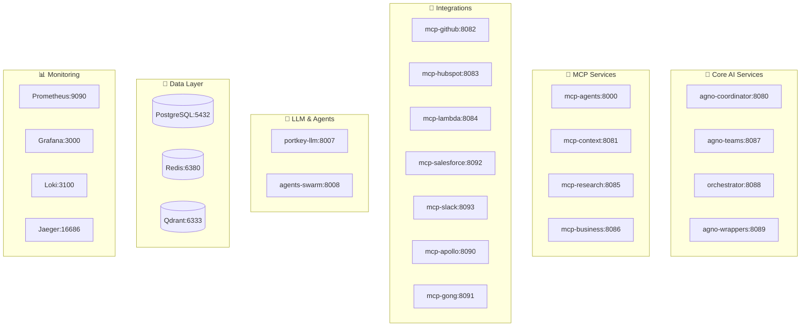

# Sophia AI Intel Platform - Developer Guide

## 🚀 Quick Start

Welcome to the Sophia AI Intel platform! This comprehensive guide will get you up and running with our advanced 17-microservice AI coordination platform.

### Prerequisites

- Docker & Docker Compose
- Node.js 18+ and Python 3.9+
- 16GB+ RAM recommended
- 50GB+ free disk space

### One-Command Setup

```bash
# Clone and start the full platform
git clone <repository-url> sophia-ai-intel-1
cd sophia-ai-intel-1
./scripts/dev-utils.sh setup-dev
docker-compose --env-file .env.local up -d
```

## 📋 Table of Contents

1. [Architecture Overview](#architecture-overview)
2. [Development Environment](#development-environment)
3. [Service Directory](#service-directory)
4. [Development Workflow](#development-workflow)
5. [Testing Guide](#testing-guide)
6. [Debugging & Profiling](#debugging--profiling)
7. [Monitoring & Observability](#monitoring--observability)
8. [Troubleshooting](#troubleshooting)
9. [Performance Optimization](#performance-optimization)
10. [Security Considerations](#security-considerations)

---

## 🏗️ Architecture Overview

The Sophia AI Intel platform consists of 17+ microservices organized into logical groups:



### Service Communication

- **HTTP/REST**: Primary communication protocol
- **WebSocket**: Real-time updates and streaming
- **gRPC**: High-performance inter-service calls
- **Message Queue**: Async processing via Redis
- **Event Streaming**: Real-time event propagation

---

## 🛠️ Development Environment

### Environment Configurations

We provide three pre-configured environments:

| Environment | File | Purpose | Features |
|-------------|------|---------|----------|
| **Local** | `.env.local` | Development work | Mock services, debug ports, hot reload |
| **Development** | `.env.development` | Team development | Real integrations, shared resources |
| **Test** | `.env.test` | Automated testing | Isolated databases, test fixtures |

### Quick Environment Switch

```bash
# Switch to local development
cp .env.local .env

# Switch to team development  
cp .env.development .env

# Switch to test environment
cp .env.test .env
```

### Development Tools

| Tool | URL | Purpose |
|------|-----|---------|
| **Adminer** | http://localhost:8080 | Database management |
| **Redis Commander** | http://localhost:8081 | Redis inspection |
| **Grafana** | http://localhost:3000 | Metrics & dashboards |
| **Jaeger** | http://localhost:16686 | Distributed tracing |
| **Prometheus** | http://localhost:9090 | Metrics collection |

---

## 📂 Service Directory

### Core AI Services

#### `agno-coordinator` (Port: 8080)
**Primary AI coordination and task routing service**

```bash
# Debug ports
Debug: 5678 (Python debugpy)
Health: GET /health
Metrics: GET /metrics

# Key endpoints
POST /api/v1/coordinate    # Route AI tasks
GET  /api/v1/status       # Service status
POST /api/v1/shutdown     # Graceful shutdown
```

**Common Issues:**
- High memory usage → Check model loading
- Slow response times → Profile with `./scripts/debug-profiler.sh profile agno-coordinator 60 cpu`

#### `agno-teams` (Port: 8087)
**Multi-agent team coordination**

```bash
# Specialized endpoints
POST /api/v1/teams/create     # Create agent team
GET  /api/v1/teams/{id}      # Get team status
POST /api/v1/teams/{id}/task # Assign team task
```

#### `orchestrator` (Port: 8088)
**Main workflow orchestration engine**

```bash
# Workflow management
POST /api/v1/workflows       # Create workflow
GET  /api/v1/workflows/{id}  # Get workflow status
PUT  /api/v1/workflows/{id}  # Update workflow
```

### MCP Services

#### `mcp-agents` (Port: 8000)
**Model Context Protocol agent management**

```bash
# Agent operations  
POST /api/v1/agent/execute   # Execute agent task
GET  /api/v1/agent/list      # List available agents
POST /api/v1/agent/create    # Create new agent
```

#### `mcp-research` (Port: 8085)
**Research and knowledge retrieval**

```bash
# Research endpoints
POST /api/v1/research/query    # Search knowledge base
GET  /api/v1/research/sources  # List sources
POST /api/v1/research/index    # Index new content
```

### Integration Services

#### `mcp-github` (Port: 8082)
**GitHub integration and repository management**

```bash
# GitHub operations
GET  /api/v1/repos           # List repositories
POST /api/v1/repos/{id}/pr   # Create pull request  
GET  /api/v1/issues          # List issues
```

**Environment Variables:**
- `GITHUB_TOKEN` - GitHub API token
- `GITHUB_WEBHOOK_SECRET` - Webhook validation

#### `mcp-hubspot` (Port: 8083)
**CRM and customer data integration**

```bash
# CRM operations
GET  /api/v1/contacts        # List contacts
POST /api/v1/deals           # Create deals
GET  /api/v1/pipeline        # Get pipeline data
```

### LLM Services

#### `portkey-llm` (Port: 8007)
**Large Language Model routing and management**

```bash
# LLM operations
POST /api/v1/chat/completions  # Chat completions
POST /api/v1/embeddings        # Generate embeddings
GET  /api/v1/models           # List available models
```

**Performance Notes:**
- CPU-intensive model loading
- High memory requirements
- GPU acceleration available

---

## 🔄 Development Workflow

### Hot Reloading

The platform supports intelligent hot reloading for rapid development:

```bash
# Start development workflow with file watching
./scripts/dev-workflow.sh start

# Monitor file changes
./scripts/dev-workflow.sh status

# Stop workflow
./scripts/dev-workflow.sh stop
```

**Supported File Types:**
- **Python**: `.py` files → Automatic service restart
- **JavaScript/TypeScript**: `.js, .ts` files → Nodemon restart
- **Configuration**: `.yml, .json` files → Config reload
- **Docker**: `Dockerfile, docker-compose.yml` → Container rebuild

### Code Quality

Pre-commit hooks ensure code quality:

```bash
# Install pre-commit hooks
pre-commit install

# Run manually
pre-commit run --all-files

# Skip hooks (emergency only)
git commit --no-verify -m "Emergency commit"
```

### Database Operations

```bash
# Run migrations
./scripts/database/migrate.sh up

# Rollback migration
./scripts/database/migrate.sh down

# Reset development database
./scripts/dev-utils.sh reset-db

# Seed test data
./scripts/dev-utils.sh seed-data
```

---

## 🧪 Testing Guide

### Test Categories

Our comprehensive testing framework includes:

| Category | Command | Purpose |
|----------|---------|---------|
| **Unit** | `pytest tests/unit/` | Individual component testing |
| **Integration** | `pytest tests/integration/ -m integration` | Service interaction testing |
| **E2E** | `pytest tests/e2e/ -m e2e` | Full workflow testing |
| **Performance** | `pytest tests/performance/ -m performance` | Load and stress testing |
| **Security** | `pytest tests/security/ -m security` | Security vulnerability testing |

### Running Tests

```bash
# Run all tests with coverage
pytest tests/ --cov=services/ --cov-report=html

# Run specific service tests
pytest tests/services/test_agno_coordinator.py -v

# Run integration tests only
pytest tests/integration/ -m integration

# Run with specific markers
pytest -m "not slow and not external"

# Generate coverage report
pytest --cov-report=html
open htmlcov/index.html
```

### Test Data Management

```bash
# Load test fixtures
pytest --fixtures tests/fixtures/

# Clean test databases
./scripts/dev-utils.sh clean-test-data

# Generate test data
./scripts/dev-utils.sh generate-test-data 1000
```

---

## 🐛 Debugging & Profiling

### Debugger Attachment

Each service exposes debug ports for IDE attachment:

```bash
# List available debug ports
./scripts/debug-profiler.sh dashboard

# Attach debugger to specific service
./scripts/debug-profiler.sh attach agno-coordinator
```

**VS Code Debug Configuration:**

```json
{
    "name": "Debug agno-coordinator",
    "type": "python",
    "request": "attach",
    "connect": {
        "host": "localhost",
        "port": 5678
    },
    "pathMappings": [
        {
            "localRoot": "${workspaceFolder}/services/agno-coordinator",
            "remoteRoot": "/app"
        }
    ]
}
```

### Performance Profiling

```bash
# CPU profiling
./scripts/debug-profiler.sh profile agno-coordinator 60 cpu

# Memory profiling  
./scripts/debug-profiler.sh profile mcp-agents 30 memory

# I/O profiling
./scripts/debug-profiler.sh profile orchestrator 45 io

# Interactive debugging session
./scripts/debug-profiler.sh shell portkey-llm
```

### Log Analysis

```bash
# Analyze service logs
./scripts/debug-profiler.sh logs agno-coordinator 1000

# Real-time log streaming
docker-compose logs -f agno-coordinator

# Search logs with patterns
./scripts/dev-utils.sh search-logs "ERROR" --service agno-coordinator
```

---

## 📊 Monitoring & Observability

### Health Monitoring

Comprehensive health monitoring with automatic recovery:

```bash
# Start health monitor
./scripts/health-monitor.sh start

# View current status
./scripts/health-monitor.sh status

# Manual service recovery
./scripts/health-monitor.sh recover agno-coordinator

# View health events
./scripts/health-monitor.sh events 50
```

### Metrics & Dashboards

Access monitoring tools:

| Dashboard | URL | Purpose |
|-----------|-----|---------|
| **Platform Overview** | http://localhost:3000/d/sophia-ai-overview | System-wide metrics |
| **Development Dashboard** | http://localhost:3000/d/sophia-ai-development | Dev-specific metrics |
| **Service Metrics** | http://localhost:9090 | Raw Prometheus metrics |
| **Distributed Tracing** | http://localhost:16686 | Request tracing |

### Custom Metrics

Add custom metrics to your services:

```python
# Python example
from prometheus_client import Counter, Histogram

REQUEST_COUNT = Counter('requests_total', 'Total requests')
REQUEST_DURATION = Histogram('request_duration_seconds', 'Request duration')

@REQUEST_DURATION.time()
def process_request():
    REQUEST_COUNT.inc()
    # Your logic here
```

---

## 🔧 Troubleshooting

### Common Issues

#### Service Won't Start

**Symptoms:** Service shows as "Exited" in `docker-compose ps`

```bash
# Check service logs
docker-compose logs agno-coordinator

# Common fixes
docker-compose restart agno-coordinator  # Simple restart
docker-compose up -d --force-recreate agno-coordinator  # Force recreate
```

**Most Common Causes:**
1. **Port conflicts** → Check `netstat -tulpn | grep :8080`
2. **Database connection** → Verify PostgreSQL is running
3. **Missing environment variables** → Check `.env` file
4. **Memory issues** → Increase Docker memory limit

#### High Memory Usage

```bash
# Check memory usage by service
docker stats --format "table {{.Name}}\t{{.MemUsage}}\t{{.MemPerc}}"

# Profile memory usage
./scripts/debug-profiler.sh profile agno-coordinator 60 memory

# Memory optimization
./scripts/dev-utils.sh optimize-memory
```

#### Slow Performance

```bash
# Performance analysis
./scripts/stress-test.sh service agno-coordinator 60

# Database query analysis
./scripts/dev-utils.sh analyze-slow-queries

# Enable query logging
./scripts/dev-utils.sh enable-query-logging
```

#### Database Connection Issues

```bash
# Test database connectivity
./scripts/dev-utils.sh test-db-connection

# Reset database connections
./scripts/dev-utils.sh reset-db-connections

# Check connection pool status
./scripts/dev-utils.sh db-pool-status
```

### Automated Diagnostics

Run automated system health checks:

```bash
# Comprehensive system check
./scripts/dev-utils.sh health-check

# Network connectivity test
./scripts/dev-utils.sh network-test

# Performance baseline
./scripts/dev-utils.sh performance-baseline

# Security scan
./scripts/dev-utils.sh security-scan
```

### Emergency Recovery

**Complete System Reset:**

```bash
# Nuclear option - full reset
./scripts/dev-utils.sh nuclear-reset

# This will:
# - Stop all services
# - Remove all volumes
# - Rebuild all containers
# - Reset databases
# - Restore from backup if available
```

**Service-Specific Recovery:**

```bash
# Recover specific service
./scripts/dev-utils.sh recover-service agno-coordinator

# This includes:
# - Stop service gracefully
# - Check dependencies
# - Clear cache/temp files
# - Restart with health check
```

---

## ⚡ Performance Optimization

### Database Optimization

```bash
# Optimize PostgreSQL settings
./scripts/dev-utils.sh optimize-postgres

# Analyze and fix slow queries
./scripts/dev-utils.sh analyze-queries

# Update database statistics
./scripts/dev-utils.sh update-stats
```

### Caching Strategy

```bash
# Redis cache analysis
./scripts/dev-utils.sh redis-analysis

# Clear cache
./scripts/dev-utils.sh clear-cache

# Cache hit ratio
./scripts/dev-utils.sh cache-stats
```

### Load Testing

```bash
# Comprehensive load test
./scripts/stress-test.sh full 300 50 200

# Test specific service
./scripts/stress-test.sh service agno-coordinator 120

# AI-specific load test
./scripts/stress-test.sh ai portkey-llm 60 10
```

---

## 🔒 Security Considerations

### Development Security

```bash
# Security scan
./scripts/dev-utils.sh security-scan

# Check for vulnerabilities
./scripts/dev-utils.sh vulnerability-check

# Update security patches
./scripts/dev-utils.sh security-update
```

### SSL/TLS Configuration

```bash
# Generate local certificates
./scripts/ssl/generate-local-certs.sh

# Verify certificate validity
./scripts/dev-utils.sh verify-certs

# Renew certificates
./scripts/ssl/generate-local-certs.sh --renew
```

### Secrets Management

```bash
# Rotate secrets
./scripts/dev-utils.sh rotate-secrets

# Check for exposed secrets
./scripts/dev-utils.sh scan-secrets

# Validate environment variables
./scripts/dev-utils.sh validate-env
```

---

## 📚 Additional Resources

### API Documentation

- **OpenAPI Specs**: Available at `/docs` endpoint for each service
- **Postman Collection**: `docs/postman/sophia-ai-collection.json`
- **GraphQL Playground**: http://localhost:8080/graphql

### Development Tools

```bash
# Code formatting
./scripts/dev-utils.sh format-code

# Dependency analysis
./scripts/dev-utils.sh analyze-deps

# Generate documentation
./scripts/dev-utils.sh generate-docs
```

### Useful Commands Reference

```bash
# Quick service restart
./scripts/dev-utils.sh restart-service <service-name>

# View service configuration
./scripts/dev-utils.sh show-config <service-name>

# Export logs
./scripts/dev-utils.sh export-logs [date-range]

# Backup development data
./scripts/dev-utils.sh backup-dev-data

# Clean Docker resources
./scripts/dev-utils.sh clean-docker
```

---

## 🆘 Getting Help

1. **Check logs first**: `docker-compose logs <service-name>`
2. **Run diagnostics**: `./scripts/dev-utils.sh health-check`
3. **Search documentation**: This guide is searchable
4. **Check monitoring**: http://localhost:3000
5. **Ask the team**: #sophia-ai-development Slack channel

### Support Contacts

- **Platform Team**: sophia-platform@company.com
- **DevOps Support**: devops@company.com
- **Security Issues**: security@company.com

---

**Happy Coding! 🚀**

*This documentation is auto-generated and updated with each deployment.*

*Last updated: $(date -Iseconds)*