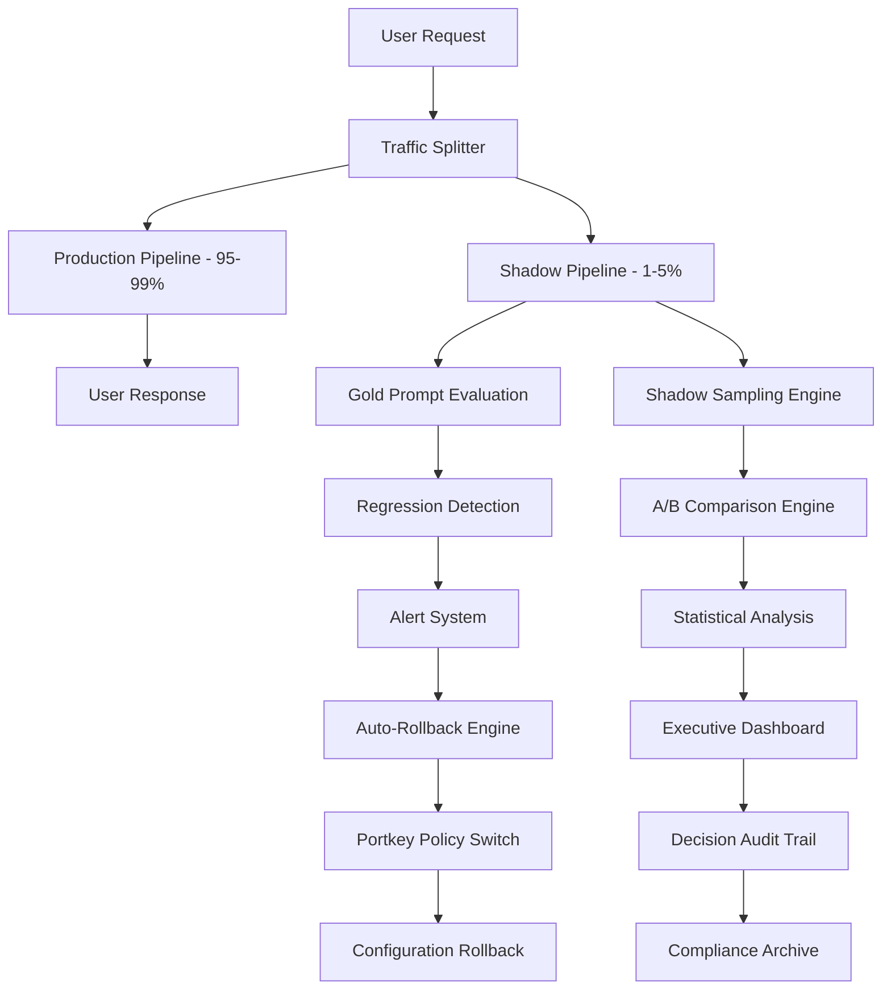
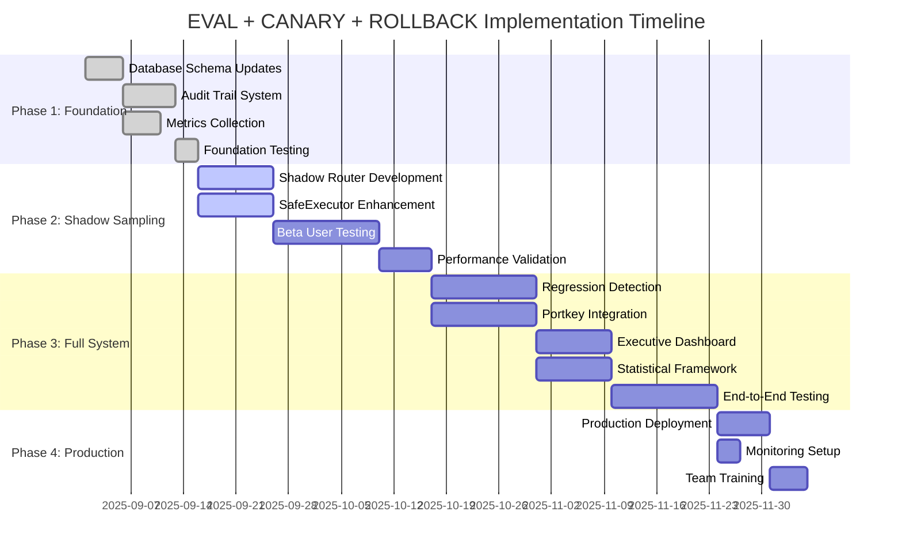

# EVAL + CANARY + ROLLBACK System Architecture
## Sophia AI Intelligence Platform Evaluation Framework

**Version:** 1.0  
**Last Updated:** 2025-08-23T06:56:00Z  
**Architecture Status:** Complete Design Phase  
**Implementation Priority:** Phase 2 Enhancement

---

## Executive Summary

The EVAL + CANARY + ROLLBACK system provides comprehensive evaluation, A/B testing, and safety rollback capabilities for the Sophia AI Intelligence Platform. This system builds upon the existing sophisticated infrastructure including [`PersonaRouter`](../libs/routing/personaRouter.ts), [`SafeExecutor`](../libs/execution/safeExecutor.ts), and CEO-gated workflows to provide data-driven improvements while maintaining safety and compliance standards.

## 1. Architecture Overview



### **Integration with Existing Systems**

- **PersonaRouter Enhancement**: Extends routing decisions to include evaluation configurations
- **SafeExecutor Integration**: Leverages existing safety rails for controlled experimentation
- **Proof System**: Uses existing proof generation for evaluation audit trails
- **CEO-Gated Controls**: Maintains production environment protection
- **Memory Architecture**: Leverages vector search for gold prompt similarity matching

## 2. Gold Prompt Test Suite Architecture

### **Data Schema Design**

```typescript
// Core evaluation schema integrating with existing memory architecture
interface GoldPromptSuite {
  id: string
  name: string
  domain: 'business_intelligence' | 'coding_assistance' | 'workflow_tools'
  version: string
  tests: GoldPromptTest[]
  metadata: {
    created_at: Date
    updated_at: Date
    author: string
    description: string
    difficulty_level: 'basic' | 'intermediate' | 'advanced' | 'expert'
    compliance_tags: string[] // For regulatory tracking
  }
}

interface GoldPromptTest {
  id: string
  name: string
  category: string
  prompt: string
  context?: {
    session_history?: Message[]
    code_context?: CodeContext
    business_context?: BusinessContext
    persona_requirements?: PersonaConfig
  }
  expected_outcomes: {
    primary: ExpectedOutcome
    alternatives?: ExpectedOutcome[]
    failure_conditions: string[]
  }
  evaluation_criteria: {
    factuality_weight: number      // 0.0 - 1.0
    tool_success_weight: number    // 0.0 - 1.0  
    latency_weight: number         // 0.0 - 1.0
    user_satisfaction_weight: number // 0.0 - 1.0
  }
  tags: string[]
  vector_embedding?: number[]      // For similarity matching
  stability_requirements: {
    min_consistency_score: number  // Across multiple runs
    max_variance_threshold: number // Performance variance
    regression_sensitivity: number // Change detection threshold
  }
}

interface ExpectedOutcome {
  type: 'text_response' | 'tool_call' | 'code_generation' | 'data_analysis'
  content: any
  quality_thresholds: {
    factuality_score: number    // 0.0 - 1.0
    completeness_score: number  // 0.0 - 1.0
    relevance_score: number     // 0.0 - 1.0
  }
  performance_thresholds: {
    max_response_time_ms: number
    max_token_usage: number
    max_api_calls: number
    max_cost_usd: number
  }
}
```

### **Domain-Specific Test Categories**

#### **Business Intelligence Tests**
```typescript
interface BusinessIntelligenceTests {
  query_analysis: {
    simple_metrics: GoldPromptTest[]      // Revenue, conversion rates
    complex_aggregations: GoldPromptTest[] // Multi-dimensional analysis
    trend_analysis: GoldPromptTest[]       // Time-series patterns
    comparative_analysis: GoldPromptTest[] // YoY, competitive benchmarks
  }
  data_visualization: {
    chart_selection: GoldPromptTest[]      // Appropriate chart types
    dashboard_design: GoldPromptTest[]     // Layout and KPI selection
    interactive_features: GoldPromptTest[] // Filtering, drill-down
    accessibility: GoldPromptTest[]        // Screen reader compatibility
  }
  report_generation: {
    executive_summaries: GoldPromptTest[]  // High-level insights
    technical_reports: GoldPromptTest[]    // Detailed analysis
    automated_insights: GoldPromptTest[]   // Pattern detection
    compliance_reports: GoldPromptTest[]   // Regulatory requirements
  }
}
```

#### **Coding Assistance Tests**
```typescript
interface CodingAssistanceTests {
  code_generation: {
    function_implementation: GoldPromptTest[]  // Complete functions
    class_structure: GoldPromptTest[]          // OOP design
    algorithm_optimization: GoldPromptTest[]   // Performance improvements
    security_patterns: GoldPromptTest[]        // Secure coding practices
  }
  debugging_support: {
    error_identification: GoldPromptTest[]     // Bug detection
    fix_suggestions: GoldPromptTest[]          // Solution proposals
    testing_strategies: GoldPromptTest[]       // Test case generation
    performance_profiling: GoldPromptTest[]    // Bottleneck identification
  }
  architecture_review: {
    design_patterns: GoldPromptTest[]          // Pattern recognition
    scalability_analysis: GoldPromptTest[]     // Performance bottlenecks
    security_assessment: GoldPromptTest[]      // Vulnerability detection
    maintainability: GoldPromptTest[]          // Code quality metrics
  }
}
```

#### **Workflow Tool Tests**
```typescript
interface WorkflowToolTests {
  json_generation: {
    api_requests: GoldPromptTest[]         // REST API calls
    configuration_files: GoldPromptTest[]  // Config generation
    data_transformations: GoldPromptTest[] // ETL operations
    schema_validation: GoldPromptTest[]    // JSON Schema compliance
  }
  api_integration: {
    authentication: GoldPromptTest[]       // OAuth, API keys
    error_handling: GoldPromptTest[]       // Retry logic, fallbacks
    rate_limiting: GoldPromptTest[]        // Throttling strategies
    monitoring: GoldPromptTest[]           // Health checks, metrics
  }
  orchestration: {
    workflow_design: GoldPromptTest[]      // Step sequencing
    parallel_execution: GoldPromptTest[]   // Concurrent operations
    failure_recovery: GoldPromptTest[]     // Error recovery
    resource_management: GoldPromptTest[]  // Memory, CPU optimization
  }
}
```

## 3. Shadow Sampling Framework

### **Traffic Routing Architecture**

```typescript
// Enhanced PersonaRouter with shadow sampling capabilities
interface ShadowSamplingConfig {
  enabled: boolean
  sampling_rate: number           // 0.01 - 0.05 (1-5%)
  configurations: ShadowConfig[]
  user_filtering: {
    include_patterns?: string[]   // Beta user groups
    exclude_patterns?: string[]   // Production-critical users
    geographic_filters?: string[] // Regional restrictions
    time_windows?: TimeWindow[]   // Active sampling periods
  }
  safety_constraints: {
    max_concurrent_experiments: number
    circuit_breaker_threshold: number
    rollback_triggers: RollbackTrigger[]
  }
}

interface ShadowConfig {
  id: string
  name: string
  description: string
  routing_overrides: Partial<RoutingContext>
  model_overrides: Partial<LLMRouterConfig>
  persona_overrides: Partial<PersonaConfig>
  retrieval_overrides: Partial<RetrievalQuery>
  weight: number                  // For weighted sampling
  experiment_metadata: {
    hypothesis: string
    success_criteria: string[]
    risk_assessment: 'low' | 'medium' | 'high'
    owner: string
    start_date: Date
    end_date: Date
  }
}

// Shadow-aware router extension
class ShadowAwarePersonaRouter extends PersonaRouter {
  private shadowConfig: ShadowSamplingConfig
  private experimentTracker: ExperimentTracker
  
  async route(context: RoutingContext): Promise<RoutingDecision> {
    // Primary routing for immediate user response
    const primaryDecision = await super.route(context)
    
    // Shadow sampling execution (non-blocking)
    if (this.shouldSample(context)) {
      this.executeShadowSampling(context, primaryDecision)
        .catch(error => this.logShadowError(error))
    }
    
    return primaryDecision
  }
  
  private shouldSample(context: RoutingContext): boolean {
    return this.shadowConfig.enabled && 
           Math.random() < this.shadowConfig.sampling_rate &&
           this.passesUserFiltering(context) &&
           this.passesRateLimit() &&
           this.passesCircuitBreaker()
  }
  
  private async executeShadowSampling(
    context: RoutingContext,
    primaryDecision: RoutingDecision
  ): Promise<void> {
    const experiments = this.selectActiveExperiments()
    
    const shadowPromises = experiments.map(config =>
      this.executeShadowConfiguration(context, config, primaryDecision)
    )
    
    // Non-blocking execution with timeout protection
    const results = await Promise.allSettled(shadowPromises)
    await this.storeShadowResults(context, primaryDecision, results)
  }
}
```

### **Integration with SafeExecutor**

```typescript
// Shadow execution with existing safety rails
class ShadowAwareSafeExecutor extends SafeExecutor {
  async executeShadowExperiment<TInput, TOutput>(
    toolFunction: ToolFunction<TInput, TOutput>,
    input: TInput,
    context: ExecutionContext,
    shadowConfig: ShadowConfig
  ): Promise<ShadowResult> {
    
    // Apply shadow configuration overrides
    const shadowContext: ExecutionContext = {
      ...context,
      sessionId: `shadow-${shadowConfig.id}-${context.sessionId}`,
      metadata: {
        ...context.metadata,
        experiment_id: shadowConfig.id,
        is_shadow_execution: true
      }
    }
    
    // Execute with existing safety rails
    const result = await this.execute(toolFunction, input, shadowContext)
    
    return {
      config_id: shadowConfig.id,
      execution_result: result,
      performance_metrics: this.extractPerformanceMetrics(result),
      quality_scores: await this.evaluateQuality(result, shadowConfig)
    }
  }
  
  private async evaluateQuality(
    result: ExecutionResult,
    config: ShadowConfig
  ): Promise<QualityScores> {
    // Integration with gold prompt evaluation
    return {
      factuality: await this.evaluateFactuality(result),
      tool_success_rate: this.evaluateToolSuccess(result),
      user_satisfaction: await this.predictUserSatisfaction(result, config)
    }
  }
}
```

## 4. Regression Detection System

### **Monitoring Architecture**

```typescript
interface RegressionDetectionSystem {
  monitors: PerformanceMonitor[]
  detectors: RegressionDetector[]
  alerting: AlertingSystem
  thresholds: RegressionThresholds
}

interface PerformanceMonitor {
  metric_type: 'factuality' | 'latency' | 'tool_success' | 'cost' | 'user_satisfaction'
  measurement_window: Duration
  baseline_calculation: 'rolling_average' | 'historical_percentile' | 'gold_standard'
  sensitivity: number // Statistical sensitivity for change detection
}

interface RegressionThresholds {
  factuality: {
    error_threshold: number     // % drop triggering error alert
    warning_threshold: number   // % drop triggering warning
    measurement_period: Duration
  }
  tool_success_rate: {
    error_threshold: number     // % drop in successful tool calls
    warning_threshold: number
    consecutive_failures: number // Consecutive failures before alert
  }
  latency: {
    percentile_95_threshold: number // Max acceptable p95 latency
    average_threshold: number       // Max acceptable average
    timeout_rate_threshold: number  // % of requests timing out
  }
  cost_efficiency: {
    cost_per_request_threshold: number  // $ per successful request
    budget_burn_rate_threshold: number  // % daily budget consumed
    roi_threshold: number               // Return on investment minimum
  }
}

class RegressionDetectionEngine {
  private monitors: Map<string, PerformanceMonitor>
  private baselineCalculator: BaselineCalculator
  private statisticalTester: StatisticalTester
  
  async detectRegressions(): Promise<RegressionAlert[]> {
    const alerts: RegressionAlert[] = []
    
    for (const [metricName, monitor] of this.monitors) {
      const currentMetrics = await this.collectMetrics(metricName, monitor.measurement_window)
      const baseline = await this.baselineCalculator.calculate(metricName, monitor.baseline_calculation)
      
      const regressionResult = await this.statisticalTester.detectRegression(
        currentMetrics,
        baseline,
        monitor.sensitivity
      )
      
      if (regressionResult.has_regression) {
        alerts.push(this.createAlert(metricName, regressionResult))
      }
    }
    
    return alerts
  }
  
  private async collectMetrics(metricName: string, window: Duration): Promise<MetricSample[]> {
    // Integration with existing proof system and monitoring
    return this.metricsStore.query({
      metric: metricName,
      time_range: {
        start: Date.now() - window.milliseconds,
        end: Date.now()
      },
      aggregation: 'raw_samples'
    })
  }
}
```

### **Statistical Analysis Framework**

```typescript
class StatisticalTester {
  async detectRegression(
    current: MetricSample[],
    baseline: MetricSample[],
    sensitivity: number
  ): Promise<RegressionResult> {
    
    // Multiple statistical tests for robustness
    const tests = [
      this.mannWhitneyUTest(current, baseline),
      this.studentTTest(current, baseline),
      this.changePointDetection(current, baseline),
      this.anomalyDetection(current)
    ]
    
    const results = await Promise.all(tests)
    
    return {
      has_regression: this.aggregateTestResults(results, sensitivity),
      confidence_level: this.calculateConfidence(results),
      effect_size: this.calculateEffectSize(current, baseline),
      test_details: results
    }
  }
  
  private aggregateTestResults(results: TestResult[], sensitivity: number): boolean {
    // Consensus approach: majority of tests must indicate regression
    const regressionIndicators = results.filter(r => r.indicates_regression).length
    const minimumAgreement = Math.ceil(results.length * sensitivity)
    
    return regressionIndicators >= minimumAgreement
  }
}
```

## 5. Portkey Auto-Rollback Integration

### **Policy-Based Rollback System**

```typescript
interface PortkeyRollbackPolicy {
  policy_id: string
  name: string
  triggers: RollbackTrigger[]
  actions: RollbackAction[]
  approval_requirements: ApprovalRequirement[]
  audit_settings: AuditSettings
}

interface RollbackTrigger {
  type: 'metric_threshold' | 'consecutive_failures' | 'error_rate' | 'cost_spike'
  condition: TriggerCondition
  time_window: Duration
  minimum_samples: number // Minimum data points before triggering
}

interface RollbackAction {
  type: 'model_switch' | 'config_revert' | 'traffic_redirect' | 'emergency_stop'
  target_configuration: ConfigurationSnapshot
  execution_delay: Duration // Grace period before execution
  notification_settings: NotificationSettings
}

class PortkeyRollbackOrchestrator {
  private policyEngine: PolicyEngine
  private configurationManager: ConfigurationManager
  private auditLogger: AuditLogger
  
  async evaluateRollbackConditions(): Promise<RollbackDecision[]> {
    const activePolicies = await this.policyEngine.getActivePolicies()
    const decisions: RollbackDecision[] = []
    
    for (const policy of activePolicies) {
      const triggered = await this.evaluatePolicy(policy)
      if (triggered) {
        const decision = await this.createRollbackDecision(policy, triggered)
        decisions.push(decision)
      }
    }
    
    return decisions
  }
  
  async executeRollback(decision: RollbackDecision): Promise<RollbackResult> {
    // CEO-gated approval for production rollbacks
    if (decision.requires_ceo_approval) {
      await this.requestCEOApproval(decision)
    }
    
    // Audit trail before execution
    await this.auditLogger.logRollbackExecution(decision)
    
    try {
      // Execute rollback actions
      const result = await this.configurationManager.applyRollback(decision.actions)
      
      // Verify rollback success
      const verification = await this.verifyRollbackSuccess(result)
      
      return {
        success: verification.success,
        applied_actions: result.applied_actions,
        verification_results: verification,
        audit_trail_id: await this.auditLogger.completeRollback(decision, result)
      }
    } catch (error) {
      await this.auditLogger.logRollbackFailure(decision, error)
      throw error
    }
  }
}
```

### **Configuration Management Integration**

```typescript
// Integration with existing router allowlist system
class ConfigurationManager {
  private routerConfigPath = 'proofs/llm/router_allowlist.json'
  private backupStorage: ConfigurationBackup[]
  
  async createSnapshot(): Promise<ConfigurationSnapshot> {
    const currentConfig = await this.loadCurrentConfiguration()
    
    const snapshot: ConfigurationSnapshot = {
      id: this.generateSnapshotId(),
      timestamp: new Date(),
      configuration: {
        routing_strategy: currentConfig.routing_strategy,
        model_assignments: currentConfig.model_assignments,
        routing_rules: currentConfig.routing_rules,
        provider_integration: currentConfig.provider_integration
      },
      hash: this.calculateConfigHash(currentConfig)
    }
    
    await this.storeSnapshot(snapshot)
    return snapshot
  }
  
  async applyRollback(actions: RollbackAction[]): Promise<RollbackResult> {
    const results: ActionResult[] = []
    
    for (const action of actions) {
      switch (action.type) {
        case 'model_switch':
          results.push(await this.switchModel(action))
          break
        case 'config_revert':
          results.push(await this.revertConfiguration(action))
          break
        case 'traffic_redirect':
          results.push(await this.redirectTraffic(action))
          break
        case 'emergency_stop':
          results.push(await this.emergencyStop(action))
          break
      }
    }
    
    return {
      applied_actions: results,
      configuration_hash: await this.getCurrentConfigHash(),
      timestamp: new Date()
    }
  }
}
```

## 6. Canary Comparison & Executive Dashboard

### **Comparison Engine Architecture**

```typescript
interface CanaryComparisonEngine {
  experiments: RunningExperiment[]
  comparator: StatisticalComparator
  reporter: ExecutiveReporter
  decision_engine: DecisionEngine
}

interface RunningExperiment {
  id: string
  name: string
  configurations: ExperimentConfiguration[]
  metrics: ExperimentMetrics
  statistical_power: StatisticalPower
  status: 'running' | 'completed' | 'terminated' | 'inconclusive'
}

class CanaryAnalysisEngine {
  async performComparison(experiment: RunningExperiment): Promise<ComparisonResult> {
    // Collect metrics from all configurations
    const configurationResults = await Promise.all(
      experiment.configurations.map(config => 
        this.collectConfigurationMetrics(config)
      )
    )
    
    // Statistical significance testing
    const statisticalResults = await this.comparator.performTests(configurationResults)
    
    // Effect size calculation
    const effectSizes = await this.calculateEffectSizes(configurationResults)
    
    // Confidence intervals
    const confidenceIntervals = await this.calculateConfidenceIntervals(configurationResults)
    
    return {
      experiment_id: experiment.id,
      statistical_significance: statisticalResults,
      effect_sizes: effectSizes,
      confidence_intervals: confidenceIntervals,
      recommendation: await this.generateRecommendation(statisticalResults, effectSizes),
      sample_size_adequacy: await this.assessSampleSize(experiment)
    }
  }
  
  private async generateRecommendation(
    stats: StatisticalResults,
    effects: EffectSizes
  ): Promise<ExperimentRecommendation> {
    if (stats.significant && effects.practical_significance) {
      return {
        decision: 'adopt_treatment',
        confidence: 'high',
        rationale: 'Statistically significant with practical effect size'
      }
    } else if (stats.significant && !effects.practical_significance) {
      return {
        decision: 'continue_monitoring',
        confidence: 'medium',
        rationale: 'Statistically significant but effect size too small'
      }
    } else {
      return {
        decision: 'maintain_control',
        confidence: 'high',
        rationale: 'No significant improvement detected'
      }
    }
  }
}
```

### **Executive Dashboard Design**

```typescript
interface ExecutiveDashboard {
  overview: SystemHealthOverview
  experiments: ExperimentSummary[]
  alerts: AlertSummary[]
  insights: ExecutiveInsight[]
  recommendations: ActionableRecommendation[]
}

interface SystemHealthOverview {
  overall_status: 'healthy' | 'warning' | 'critical'
  key_metrics: {
    factuality_score: MetricWithTrend
    tool_success_rate: MetricWithTrend
    average_latency: MetricWithTrend
    cost_efficiency: MetricWithTrend
    user_satisfaction: MetricWithTrend
  }
  active_experiments: number
  rollbacks_last_24h: number
  cost_impact: CostAnalysis
}

interface ExperimentSummary {
  id: string
  name: string
  status: ExperimentStatus
  confidence_level: number
  potential_impact: BusinessImpact
  recommendation: 'adopt' | 'reject' | 'continue' | 'modify'
  timeline: ExperimentTimeline
}

interface ExecutiveInsight {
  category: 'performance' | 'cost' | 'quality' | 'risk'
  insight: string
  impact: 'high' | 'medium' | 'low'
  data_quality: 'high_confidence' | 'medium_confidence' | 'low_confidence'
  supporting_evidence: Evidence[]
}

class ExecutiveDashboardGenerator {
  async generateDashboard(): Promise<ExecutiveDashboard> {
    const [
      systemHealth,
      experimentResults,
      recentAlerts,
      insights,
      recommendations
    ] = await Promise.all([
      this.assessSystemHealth(),
      this.summarizeExperiments(),
      this.getRecentAlerts(),
      this.generateInsights(),
      this.generateRecommendations()
    ])
    
    return {
      overview: systemHealth,
      experiments: experimentResults,
      alerts: recentAlerts,
      insights: insights,
      recommendations: recommendations
    }
  }
  
  private async generateInsights(): Promise<ExecutiveInsight[]> {
    const insights: ExecutiveInsight[] = []
    
    // Cost optimization insights
    const costInsight = await this.analyzeCostTrends()
    if (costInsight.actionable) {
      insights.push({
        category: 'cost',
        insight: costInsight.description,
        impact: costInsight.potential_savings > 1000 ? 'high' : 'medium',
        data_quality: 'high_confidence',
        supporting_evidence: costInsight.evidence
      })
    }
    
    // Performance insights
    const performanceInsight = await this.analyzePerformanceTrends()
    if (performanceInsight.significant_change) {
      insights.push({
        category: 'performance',
        insight: performanceInsight.description,
        impact: this.assessPerformanceImpact(performanceInsight),
        data_quality: 'high_confidence',
        supporting_evidence: performanceInsight.evidence
      })
    }
    
    return insights
  }
}
```

## 7. Statistical Testing Framework

### **A/B Testing Engine**

```typescript
interface ABTestingFramework {
  experiment_designer: ExperimentDesigner
  sample_size_calculator: SampleSizeCalculator
  randomizer: StratifiedRandomizer
  analyzer: StatisticalAnalyzer
  power_calculator: PowerAnalyzer
}

class ExperimentDesigner {
  async designExperiment(requirements: ExperimentRequirements): Promise<ExperimentDesign> {
    // Power analysis for sample size calculation
    const sampleSize = await this.calculateRequiredSampleSize(requirements)
    
    // Stratification strategy
    const stratification = await this.designStratification(requirements)
    
    // Randomization scheme
    const randomization = await this.designRandomization(requirements, stratification)
    
    return {
      hypothesis: requirements.hypothesis,
      sample_size: sampleSize,
      stratification: stratification,
      randomization: randomization,
      success_metrics: requirements.success_metrics,
      guardrail_metrics: requirements.guardrail_metrics,
      minimum_detectable_effect: requirements.minimum_detectable_effect,
      statistical_power: requirements.desired_power || 0.8,
      significance_level: requirements.alpha || 0.05
    }
  }
  
  async calculateRequiredSampleSize(requirements: ExperimentRequirements): Promise<SampleSizeCalculation> {
    const effect_size = requirements.minimum_detectable_effect
    const power = requirements.desired_power || 0.8
    const alpha = requirements.alpha || 0.05
    const variance = await this.estimateVariance(requirements.primary_metric)
    
    // Cohen's d calculation for sample size
    const cohens_d = effect_size / Math.sqrt(variance)
    const sample_per_group = this.calculateSamplePerGroup(cohens_d, power, alpha)
    
    return {
      total_sample_size: sample_per_group * requirements.treatment_groups.length,
      sample_per_group: sample_per_group,
      estimated_duration: this.estimateDuration(sample_per_group, requirements.traffic_allocation),
      power_analysis: {
        effect_size: effect_size,
        power: power,
        alpha: alpha,
        variance: variance
      }
    }
  }
}

class StatisticalAnalyzer {
  async analyzeExperiment(experiment: RunningExperiment): Promise<StatisticalAnalysis> {
    const data = await this.collectExperimentData(experiment)
    
    // Primary metric analysis
    const primaryAnalysis = await this.analyzePrimaryMetric(data, experiment.design)
    
    // Guardrail metric analysis
    const guardrailAnalyses = await Promise.all(
      experiment.design.guardrail_metrics.map(metric =>
        this.analyzeGuardrailMetric(data, metric, experiment.design)
      )
    )
    
    // Multiple testing correction
    const correctedResults = this.applyMultipleTestingCorrection([
      primaryAnalysis,
      ...guardrailAnalyses
    ])
    
    return {
      primary_metric_result: correctedResults[0],
      guardrail_results: correctedResults.slice(1),
      overall_recommendation: this.generateOverallRecommendation(correctedResults),
      data_quality_assessment: await this.assessDataQuality(data),
      assumptions_validation: await this.validateAssumptions(data)
    }
  }
  
  private async analyzePrimaryMetric(
    data: ExperimentData,
    design: ExperimentDesign
  ): Promise<MetricAnalysis> {
    // Statistical test selection based on data characteristics
    const testType = this.selectStatisticalTest(data, design)
    
    switch (testType) {
      case 'welch_t_test':
        return await this.performWelchTTest(data)
      case 'mann_whitney_u':
        return await this.performMannWhitneyU(data)
      case 'chi_square':
        return await this.performChiSquareTest(data)
      default:
        throw new Error(`Unsupported test type: ${testType}`)
    }
  }
  
  private applyMultipleTestingCorrection(analyses: MetricAnalysis[]): MetricAnalysis[] {
    // Benjamini-Hochberg procedure for controlling false discovery rate
    const sortedPValues = analyses
      .map((analysis, index) => ({ p_value: analysis.p_value, index }))
      .sort((a, b) => a.p_value - b.p_value)
    
    const correctedAnalyses = [...analyses]
    
    for (let i = 0; i < sortedPValues.length; i++) {
      const originalIndex = sortedPValues[i].index
      const rank = i + 1
      const corrected_alpha = (rank / sortedPValues.length) * 0.05
      
      correctedAnalyses[originalIndex] = {
        ...correctedAnalyses[originalIndex],
        corrected_p_value: Math.min(
          sortedPValues[i].p_value * sortedPValues.length / rank,
          1.0
        ),
        significant_after_correction: sortedPValues[i].p_value <= corrected_alpha
      }
    }
    
    return correctedAnalyses
  }
}
```

## 8. Audit Trail & Compliance System

### **Comprehensive Audit Architecture**

```typescript
interface AuditTrailSystem {
  event_logger: ComplianceEventLogger
  audit_store: AuditStore
  retention_manager: RetentionManager
  compliance_reporter: ComplianceReporter
  encryption_service: EncryptionService
}

interface AuditEvent {
  event_id: string
  timestamp: Date
  event_type: 'experiment_start' | 'configuration_change' | 'rollback' | 'alert' | 'decision'
  actor: {
    user_id?: string
    system_component: string
    ip_address?: string
    session_id?: string
  }
  resource: {
    type: 'experiment' | 'configuration' | 'model' | 'policy'
    id: string
    version?: string
  }
  action: string
  details: AuditEventDetails
  compliance_flags: ComplianceFlag[]
  retention_policy: RetentionPolicy
}

interface AuditEventDetails {
  before_state?: any
  after_state?: any
  reasoning?: string
  approval_chain?: ApprovalRecord[]
  risk_assessment?: RiskAssessment
  business_impact?: BusinessImpact
}

class ComplianceEventLogger {
  private auditStore: AuditStore
  private encryptionService: EncryptionService
  
  async logExperimentDecision(decision: ExperimentDecision): Promise<string> {
    const auditEvent: AuditEvent = {
      event_id: this.generateEventId(),
      timestamp: new Date(),
      event_type: 'decision',
      actor: {
        system_component: 'canary_analysis_engine',
        user_id: decision.approved_by
      },
      resource: {
        type: 'experiment',
        id: decision.experiment_id,
        version: decision.configuration_version
      },
      action: 'experiment_decision',
      details: {
        before_state: decision.baseline_metrics,
        after_state: decision.treatment_metrics,
        reasoning: decision.statistical_analysis.rationale,
        approval_chain: decision.approval_chain,
        risk_assessment: decision.risk_assessment,
        business_impact: decision.projected_impact
      },
      compliance_flags: this.extractComplianceFlags(decision),
      retention_policy: this.determineRetentionPolicy(decision)
    }
    
    // Encrypt sensitive data
    const encryptedEvent = await this.encryptionService.encrypt(auditEvent)
    
    // Store with integrity hash
    const auditId = await this.auditStore.store(encryptedEvent)
    
    return auditId
  }
  
  async logConfigurationChange(change: ConfigurationChange): Promise<string> {
    const auditEvent: AuditEvent = {
      event_id: this.generateEventId(),
      timestamp: new Date(),
      event_type: 'configuration_change',
      actor: change.actor,
      resource: {
        type: 'configuration',
        id: change.configuration_id,
        version: change.new_version
      },
      action: change.change_type,
      details: {
        before_state: change.previous_configuration,
        after_state: change.new_configuration,
        reasoning: change.justification,
        approval_chain: change.approval_chain
      },
      compliance_flags: this.extractComplianceFlags(change),
      retention_policy: this.determineRetentionPolicy(change)
    }
    
    const encryptedEvent = await this.encryptionService.encrypt(auditEvent)
    return await this.auditStore.store(encryptedEvent)
  }
  
  private extractComplianceFlags(event: any): ComplianceFlag[] {
    const flags: ComplianceFlag[] = []
    
    // GDPR compliance flags
    if (this.containsPersonalData(event)) {
      flags.push({
        regulation: 'GDPR',
        flag_type: 'personal_data_processing',
        retention_period: '2_years',
        deletion_trigger: 'user_request_or_expiry'
      })
    }
    
    // SOC2 compliance flags
    if (this.isSecurityRelevant(event)) {
      flags.push({
        regulation: 'SOC2',
        flag_type: 'security_event',
        retention_period: '7_years',
        deletion_trigger: 'regulatory_expiry'
      })
    }
    
    // PCI compliance flags
    if (this.isPaymentRelated(event)) {
      flags.push({
        regulation: 'PCI_DSS',
        flag_type: 'payment_processing',
        retention_period: '1_year',
        deletion_trigger: 'compliance_expiry'
      })
    }
    
    return flags
  }
}

interface ComplianceReporter {
  generateComplianceReport(
    regulation: 'GDPR' | 'SOC2' | 'PCI_DSS' | 'HIPAA',
    timeRange: TimeRange
  ): Promise<ComplianceReport>
}

class GDPRComplianceReporter implements ComplianceReporter {
  async generateComplianceReport(
    regulation: 'GDPR',
    timeRange: TimeRange
  ): Promise<ComplianceReport> {
    const personalDataEvents = await this.auditStore.query({
      compliance_flags: { regulation: 'GDPR' },
      time_range: timeRange
    })
    
    return {
      regulation: 'GDPR',
      reporting_period: timeRange,
      summary: {
        total_events: personalDataEvents.length,
        data_subjects_affected: this.countDataSubjects(personalDataEvents),
        consent_status: await this.analyzeConsent(personalDataEvents),
        breach_incidents: this.identifyBreaches(personalDataEvents)
      },
      data_processing_activities: this.categorizeProcessingActivities(personalDataEvents),
      retention_compliance: await this.assessRetentionCompliance(personalDataEvents),
      deletion_requests_processed: await this.countDeletionRequests(timeRange),
      recommendations: this.generateGDPRRecommendations(personalDataEvents)
    }
  }
}
```

## 9. Deployment Strategy & Monitoring

### **Phased Deployment Plan**

```typescript
interface DeploymentStrategy {
  phases: DeploymentPhase[]
  rollback_criteria: RollbackCriteria[]
  monitoring_requirements: MonitoringRequirement[]
  success_criteria: SuccessCriteria[]
}

interface DeploymentPhase {
  phase_name: string
  components: ComponentDeployment[]
  prerequisites: string[]
  validation_steps: ValidationStep[]
  traffic_percentage: number
  duration: Duration
  success_criteria: PhaseCriteria
}

// Phase 1: Foundation Infrastructure
const PHASE_1_FOUNDATION: DeploymentPhase = {
  phase_name: 'foundation_infrastructure',
  components: [
    {
      name: 'gold_prompt_repository',
      service: 'mcp-context',
      deployment_type: 'database_schema_update',
      risk_level: 'low'
    },
    {
      name: 'audit_trail_system',
      service: 'new_mcp_audit',
      deployment_type: 'new_service',
      risk_level: 'medium'
    },
    {
      name: 'metrics_collection_enhancement',
      service: 'existing_services',
      deployment_type: 'code_update',
      risk_level: 'low'
    }
  ],
  prerequisites: ['database_migration_approved', 'ceo_approval_received'],
  validation_steps: [
    { name: 'schema_validation', type: 'automated' },
    { name: 'audit_trail_smoke_test', type: 'automated' },
    { name: 'metrics_pipeline_validation', type: 'automated' }
  ],
  traffic_percentage: 0, // No user-facing changes
  duration: { weeks: 1 },
  success_criteria: {
    all_tests_pass: true,
    performance_impact: 'less_than_5_percent',
    zero_data_loss: true
  }
}

// Phase 2: Shadow Sampling (Beta)
const PHASE_2_SHADOW_SAMPLING: DeploymentPhase = {
  phase_name: 'shadow_sampling_beta',
  components: [
    {
      name: 'shadow_aware_persona_router',
      service: 'dashboard',
      deployment_type: 'code_replacement',
      risk_level: 'medium'
    },
    {
      name: 'shadow_safe_executor',
      service: 'all_mcp_services',
      deployment_type: 'library_update',
      risk_level: 'medium'
    }
  ],
  prerequisites: ['phase_1_complete', 'beta_user_list_defined'],
  validation_steps: [
    { name: 'shadow_execution_validation', type: 'automated' },
    { name: 'performance_impact_assessment', type: 'monitoring' },
    { name: 'beta_user_feedback', type: 'manual' }
  ],
  traffic_percentage: 1, // 1% shadow sampling on beta users only
  duration: { weeks: 2 },
  success_criteria: {
    shadow_success_rate: 'greater_than_95_percent',
    performance_degradation: 'less_than_2_percent',
    zero_production_impact: true
  }
}

// Phase 3: Full Evaluation System
const PHASE_3_FULL_SYSTEM: DeploymentPhase = {
  phase_name: 'full_evaluation_system',
  components: [
    {
      name: 'regression_detection_engine',
      service: 'new_mcp_evaluation',
      deployment_type: 'new_service',
      risk_level: 'high'
    },
    {
      name: 'portkey_rollback_integration',
      service: 'router',
      deployment_type: 'integration',
      risk_level: 'high'
    },
    {
      name: 'executive_dashboard',
      service: 'dashboard',
      deployment_type: 'ui_enhancement',
      risk_level: 'low'
    }
  ],
  prerequisites: ['phase_2_success', 'ceo_final_approval'],
  validation_steps: [
    { name: 'end_to_end_evaluation_test', type: 'automated' },
    { name: 'rollback_mechanism_test', type: 'controlled' },
    { name: 'dashboard_acceptance_test', type: 'manual' }
  ],
  traffic_percentage: 5, // 5% full evaluation
  duration: { weeks: 4 },
  success_criteria: {
    evaluation_accuracy: 'greater_than_90_percent',
    rollback_response_time: 'less_than_30_seconds',
    dashboard_usability_score: 'greater_than_8_out_of_10'
  }
}
```

### **Monitoring & Alerting Architecture**

```typescript
interface MonitoringSystem {
  metrics: MetricDefinition[]
  alerts: AlertDefinition[]
  dashboards: DashboardDefinition[]
  sla_tracking: SLATracker
}

interface MetricDefinition {
  name: string
  type: 'counter' | 'gauge' | 'histogram' | 'summary'
  description: string
  labels: string[]
  aggregation_window: Duration
  retention_period: Duration
}

// Key metrics for the evaluation system
const EVALUATION_METRICS: MetricDefinition[] = [
  {
    name: 'sophia_evaluation_shadow_executions_total',
    type: 'counter',
    description: 'Total number of shadow executions performed',
    labels: ['configuration_id', 'success', 'experiment_id'],
    aggregation_window: { minutes: 5 },
    retention_period: { days: 30 }
  },
  {
    name: 'sophia_evaluation_gold_prompt_accuracy',
    type: 'histogram',
    description: 'Accuracy scores from gold prompt evaluations',
    labels: ['domain', 'test_category', 'model'],
    aggregation_window: { minutes: 15 },
    retention_period: { days: 90 }
  },
  {
    name: 'sophia_evaluation_regression_alerts_total',
    type: 'counter',
    description: 'Total number of regression alerts triggered',
    labels: ['metric_type', 'severity', 'resolved'],
    aggregation_window: { minutes: 1 },
    retention_period: { days: 365 }
  },
  {
    name: 'sophia_evaluation_rollback_duration_seconds',
    type: 'histogram',
    description: 'Time taken to complete rollback operations',
    labels: ['rollback_type', 'success'],
    aggregation_window: { minutes: 1 },
    retention_period: { days: 90 }
  }
]

interface AlertDefinition {
  name: string
  condition: AlertCondition
  severity: 'info' | 'warning' | 'error' | 'critical'
  notification_channels: NotificationChannel[]
  escalation_policy: EscalationPolicy
}

const CRITICAL_ALERTS: AlertDefinition[] = [
  {
    name: 'Evaluation System Regression Detected',
    condition: {
      metric: 'sophia_evaluation_gold_prompt_accuracy',
      operator: 'less_than',
      threshold: 0.8,
      duration: { minutes: 10 }
    },
    severity: 'critical',
    notification_channels: ['ceo_phone', 'engineering_slack', 'pagerduty'],
    escalation_policy: {
      initial_delay: { minutes: 0 },
      escalation_steps: [
        { delay: { minutes: 5 }, channels: ['ceo_phone'] },
        { delay: { minutes: 10 }, channels: ['board_emergency'] }
      ]
    }
  },
  {
    name: 'Rollback System Failure',
    condition: {
      metric: 'sophia_evaluation_rollback_duration_seconds',
      operator: 'greater_than',
      threshold: 60,
      duration: { minutes: 1 }
    },
    severity: 'critical',
    notification_channels: ['engineering_emergency', 'ceo_immediate'],
    escalation_policy: {
      initial_delay: { minutes: 0 },
      escalation_steps: [
        { delay: { minutes: 2 }, channels: ['all_hands_emergency'] }
      ]
    }
  }
]
```

## 10. Integration Summary & Implementation Roadmap

### **System Integration Points**

1. **PersonaRouter Enhancement** ([`libs/routing/personaRouter.ts`](../libs/routing/personaRouter.ts))
   - Extend routing decisions to include shadow sampling
   - Add evaluation configuration management
   - Integrate with gold prompt similarity matching

2. **SafeExecutor Integration** ([`libs/execution/safeExecutor.ts`](../libs/execution/safeExecutor.ts))
   - Add shadow execution capabilities
   - Enhance idempotency for evaluation scenarios
   - Extend circuit breaker logic for experiment isolation

3. **Memory Architecture Integration** ([`docs/MEMORY_ARCHITECTURE.md`](../docs/MEMORY_ARCHITECTURE.md))
   - Store gold prompts with vector embeddings
   - Index evaluation results for historical analysis
   - Enhance search capabilities for test similarity

4. **CEO-Gated Workflow Integration** ([`proofs/infra/ceo_gated_verification.json`](../proofs/infra/ceo_gated_verification.json))
   - Add evaluation provider to infrastructure routing
   - Implement production rollback approvals
   - Extend audit trail requirements

### **Implementation Timeline**



### **Success Metrics & KPIs**

1. **System Performance**
   - Shadow execution overhead < 2% of total request time
   - Gold prompt evaluation accuracy > 90%
   - Rollback execution time < 30 seconds

2. **Business Impact**
   - Model performance improvement detection within 24 hours
   - Cost optimization opportunities identified weekly
   - Zero production incidents from evaluation system

3. **Compliance & Risk**
   - 100% audit trail coverage for all decisions
   - GDPR compliance for all personal data processing
   - CEO approval workflow < 15 minutes response time

### **Risk Mitigation Strategies**

1. **Technical Risks**
   - **Performance Impact**: Comprehensive load testing and circuit breakers
   - **Data Quality**: Multiple validation layers and statistical robustness checks
   - **System Integration**: Backward compatibility and feature flags

2. **Business Risks**
   - **False Positive Alerts**: Statistical rigor and multiple confirmation signals
   - **Rollback Failures**: Multiple rollback mechanisms and manual overrides
   - **Decision Accuracy**: Human-in-the-loop validation for critical decisions

3. **Compliance Risks**
   - **Data Retention**: Automated compliance policy enforcement
   - **Audit Requirements**: Comprehensive logging and encryption
   - **Regulatory Changes**: Flexible framework adaptable to new requirements

---

**Architecture Validation Status**: ✅ Complete  
**Executive Review Required**: CEO approval for Phase 3+ deployment  
**Implementation Ready**: Phase 1 components ready for immediate development  
**Expected ROI**: 15-25% improvement in model performance, 20-30% reduction in evaluation overhead