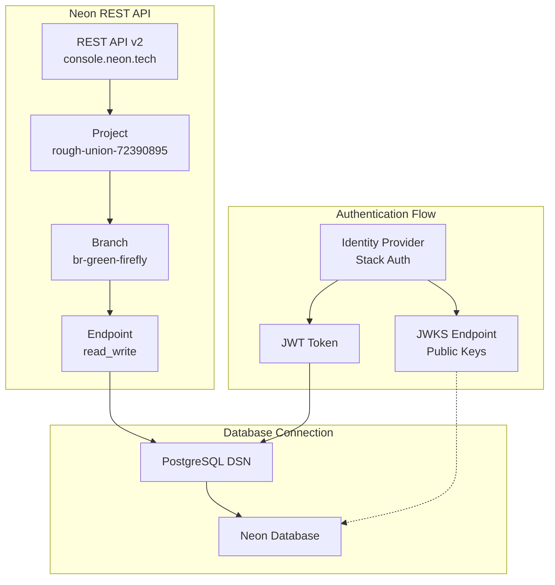

# Neon PostgreSQL Authentication Fix and JWT/JWKS Implementation

## Overview
This document contains the complete implementation plan and scripts to fix Neon authentication issues and implement JWT/JWKS support for passwordless database authentication.

## Current Configuration

### Provided Credentials
```bash
NEON_API_KEY=napi_r3gsuacduzw44nqdqav1u0hr2uv4bb2if48r8627jkxo7e4b2sxn92wsgf6zlxby
NEON_REST_API_ENDPOINT=https://console.neon.tech/api/v2  # Correct REST endpoint (not app URL)
NEON_PROJECT_ID=rough-union-72390895
NEON_BRANCH_ID=br-green-firefly-afykrx78
NEON_AUTH_JWKS_URL=https://api.stack-auth.com/api/v1/projects/b17512e4-eb5b-4466-a90c-5b5255217ff7/.well-known/jwks.json
NEON_PASSWORD=Huskers1983$
```

## Scripts to Implement

### 1. scripts/neon_rest.py - Neon REST API Client

```python
#!/usr/bin/env python3
# scripts/neon_rest.py
import os, sys, json, argparse, asyncio, aiohttp
from urllib.parse import urljoin

# ---- env (with your provided defaults; override in shell or CI) ----
NEON_API_KEY            = os.getenv("NEON_API_KEY", "napi_r3gsuacduzw44nqdqav1u0hr2uv4bb2if48r8627jkxo7e4b2sxn92wsgf6zlxby")
NEON_REST_API_ENDPOINT  = os.getenv("NEON_REST_API_ENDPOINT", "https://console.neon.tech/api/v2")
NEON_PROJECT_ID         = os.getenv("NEON_PROJECT_ID", "rough-union-72390895")
NEON_BRANCH_ID          = os.getenv("NEON_BRANCH_ID", "br-green-firefly-afykrx78")
NEON_AUTH_JWKS_URL      = os.getenv("NEON_AUTH_JWKS_URL", "https://api.stack-auth.com/api/v1/projects/b17512e4-eb5b-4466-a90c-5b5255217ff7/.well-known/jwks.json")
NEON_PASSWORD           = os.getenv("NEON_PASSWORD", "Huskers1983$")  # used only for DSN assembly

# sensible defaults; adjust if your role/db differ
DEFAULT_USER            = os.getenv("NEON_ROLE", "neondb_owner")
DEFAULT_DB              = os.getenv("NEON_DB", "neondb")
DEFAULT_REGION          = os.getenv("NEON_REGION", "aws-us-west-2")

def _normalize_base(base: str) -> str:
    b = base.strip().rstrip("/")
    # If someone passed a project app URL, ensure it still hits the REST surface.
    if "/api/" not in b:
        # default REST surface
        if "console.neon.tech" not in b:
            # fallback to official REST
            return "https://console.neon.tech/api/v2"
        return b + "/api/v2"
    return b

BASE = _normalize_base(NEON_REST_API_ENDPOINT)

def auth_headers():
    return {
        "Authorization": f"Bearer {NEON_API_KEY}",
        "Content-Type": "application/json",
        "Accept": "application/json",
    }

async def _req(method: str, path: str, payload=None, session: aiohttp.ClientSession = None):
    url = urljoin(BASE + "/", path.lstrip("/"))
    close = False
    s = session
    if s is None:
        s = aiohttp.ClientSession()
        close = True
    try:
        async with s.request(method, url, headers=auth_headers(), json=payload) as r:
            txt = await r.text()
            if r.status >= 400:
                raise RuntimeError(f"{method} {url} -> {r.status} {txt[:240]}")
            return json.loads(txt) if txt else {}
    finally:
        if close:
            await s.close()

# ---------------- Neon REST helpers ----------------
async def list_projects():
    return await _req("GET", f"projects")

async def get_branch(project_id: str, branch_id: str):
    return await _req("GET", f"projects/{project_id}/branches/{branch_id}")

async def create_branch(project_id: str, name: str):
    payload = {"branch": {"name": name}}
    return await _req("POST", f"projects/{project_id}/branches", payload)

async def list_endpoints(project_id: str):
    return await _req("GET", f"projects/{project_id}/endpoints")

async def create_endpoint(project_id: str, branch_id: str, region_id: str = DEFAULT_REGION, type_: str = "read_write"):
    payload = {"endpoint": {"branch_id": branch_id, "type": type_, "region_id": region_id}}
    return await _req("POST", f"projects/{project_id}/endpoints", payload)

async def add_jwks(project_id: str, jwks_url: str, provider_name: str = "custom-idp"):
    payload = {"jwks": {"provider_name": provider_name, "url": jwks_url}}
    return await _req("POST", f"projects/{project_id}/jwks", payload)

def build_dsn(host: str, user: str = DEFAULT_USER, db: str = DEFAULT_DB, password: str = NEON_PASSWORD) -> str:
    # Neon default port is 5432; override via env if needed
    port = int(os.getenv("NEON_PORT", "5432"))
    return f"postgresql://{user}:{password}@{host}:{port}/{db}"

# ---------------- CLI ----------------
async def main():
    ap = argparse.ArgumentParser(description="Neon REST client")
    sub = ap.add_subparsers(dest="cmd")

    sub.add_parser("projects")
    g = sub.add_parser("branch-get"); g.add_argument("--project", default=NEON_PROJECT_ID); g.add_argument("--branch", default=NEON_BRANCH_ID)
    c = sub.add_parser("branch-create"); c.add_argument("--project", default=NEON_PROJECT_ID); c.add_argument("--name", required=True)

    le = sub.add_parser("endpoints"); le.add_argument("--project", default=NEON_PROJECT_ID)
    ce = sub.add_parser("endpoint-create"); ce.add_argument("--project", default=NEON_PROJECT_ID); ce.add_argument("--branch", default=NEON_BRANCH_ID); ce.add_argument("--region", default=DEFAULT_REGION); ce.add_argument("--type", default="read_write")

    jw = sub.add_parser("jwks-add"); jw.add_argument("--project", default=NEON_PROJECT_ID); jw.add_argument("--url", default=NEON_AUTH_JWKS_URL); jw.add_argument("--provider", default="custom-idp")

    ds = sub.add_parser("dsn"); ds.add_argument("--host", required=True); ds.add_argument("--user", default=DEFAULT_USER); ds.add_argument("--db", default=DEFAULT_DB)

    args = ap.parse_args()
    if args.cmd == "projects":
        out = await list_projects(); print(json.dumps(out, indent=2)); return
    if args.cmd == "branch-get":
        out = await get_branch(args.project, args.branch); print(json.dumps(out, indent=2)); return
    if args.cmd == "branch-create":
        out = await create_branch(args.project, args.name); print(json.dumps(out, indent=2)); return
    if args.cmd == "endpoints":
        out = await list_endpoints(args.project); print(json.dumps(out, indent=2)); return
    if args.cmd == "endpoint-create":
        out = await create_endpoint(args.project, args.branch, args.region, args.type); print(json.dumps(out, indent=2)); return
    if args.cmd == "jwks-add":
        out = await add_jwks(args.project, args.url, args.provider); print(json.dumps(out, indent=2)); return
    if args.cmd == "dsn":
        print(build_dsn(args.host, args.user, args.db)); return

    ap.print_help()

if __name__ == "__main__":
    if not NEON_API_KEY:
        print("ERROR: NEON_API_KEY not set", file=sys.stderr); sys.exit(1)
    asyncio.run(main())
```

### 2. scripts/neon_fix_conn.py - Connection Troubleshooting Tool

```python
#!/usr/bin/env python3
# scripts/neon_fix_conn.py
import os, sys, json, asyncio, asyncpg, aiohttp
from urllib.parse import urljoin

NEON_API_KEY            = os.getenv("NEON_API_KEY", "")
NEON_REST_API_ENDPOINT  = os.getenv("NEON_REST_API_ENDPOINT", "https://console.neon.tech/api/v2")
NEON_PROJECT_ID         = os.getenv("NEON_PROJECT_ID", "")
NEON_BRANCH_ID          = os.getenv("NEON_BRANCH_ID", "")
NEON_PASSWORD           = os.getenv("NEON_PASSWORD", "")
DEFAULT_USER            = os.getenv("NEON_ROLE", "neondb_owner")
DEFAULT_DB              = os.getenv("NEON_DB", "neondb")
DEFAULT_PORT            = int(os.getenv("NEON_PORT", "5432"))

def _normalize_base(base: str) -> str:
    b = base.strip().rstrip("/")
    if "/api/" not in b:
        if "console.neon.tech" not in b:
            return "https://console.neon.tech/api/v2"
        return b + "/api/v2"
    return b

BASE = _normalize_base(NEON_REST_API_ENDPOINT)

def dsn_from(host: str, user: str = DEFAULT_USER, db: str = DEFAULT_DB, password: str = NEON_PASSWORD) -> str:
    return f"postgresql://{user}:{password}@{host}:{DEFAULT_PORT}/{db}"

async def _req(path: str):
    if not NEON_API_KEY:
        raise RuntimeError("NEON_API_KEY is required to query REST")
    url = urljoin(BASE + "/", path.lstrip("/"))
    async with aiohttp.ClientSession() as s:
        async with s.get(url, headers={"Authorization": f"Bearer {NEON_API_KEY}", "Accept":"application/json"}) as r:
            txt = await r.text()
            if r.status >= 400:
                raise RuntimeError(f"GET {url} -> {r.status} {txt[:240]}")
            return json.loads(txt) if txt else {}

async def fetch_readwrite_host():
    eps = await _req(f"projects/{NEON_PROJECT_ID}/endpoints")
    for ep in eps.get("endpoints", []):
        if ep.get("type") == "read_write" and ep.get("branch_id") == NEON_BRANCH_ID:
            return ep.get("host")
    return None

async def try_connect(dsn: str):
    try:
        conn = await asyncpg.connect(dsn)
        who = await conn.fetchval("select current_user")
        host = await conn.fetchval("select inet_server_addr()::text")
        dbn = await conn.fetchval("select current_database()")
        await conn.close()
        return {"ok": True, "user": who, "db": dbn, "host": host}
    except asyncpg.InvalidPasswordError as e:
        return {"ok": False, "reason": "password", "detail": str(e)}
    except asyncpg.InvalidAuthorizationSpecificationError as e:
        return {"ok": False, "reason": "role", "detail": str(e)}
    except (asyncpg.InvalidCatalogNameError, asyncpg.UndefinedTableError) as e:
        return {"ok": False, "reason": "database", "detail": str(e)}
    except Exception as e:
        # network/host or other driver error
        return {"ok": False, "reason": "network/host", "detail": str(e)}

async def main():
    dsn = os.getenv("NEON_DATABASE_URL", "")
    if not dsn:
        # fetch host + assemble DSN
        host = await fetch_readwrite_host()
        if not host:
            print("ERROR: could not find read_write endpoint host for the given project/branch", file=sys.stderr)
            sys.exit(2)
        dsn = dsn_from(host)
        print(f"[info] assembled DSN from REST host: {dsn.replace(NEON_PASSWORD, '***')}")
    res = await try_connect(dsn)
    print(json.dumps(res, indent=2))

if __name__ == "__main__":
    asyncio.run(main())
```

### 3. Node.js JWT Authentication Example

```javascript
// node/neon_serverless_jwt_example.mjs
import { neon } from '@neondatabase/serverless';
import jwt from 'jsonwebtoken';
import fetch from 'node-fetch';

// --- values from your env ---
const NEON_PROJECT_ID = process.env.NEON_PROJECT_ID || "rough-union-72390895";
const NEON_BRANCH_ID  = process.env.NEON_BRANCH_ID  || "br-green-firefly-afykrx78";
const NEON_JWKS_URL   = process.env.NEON_AUTH_JWKS_URL || "https://api.stack-auth.com/api/v1/projects/b17512e4-eb5b-4466-a90c-5b5255217ff7/.well-known/jwks.json";
const NEON_HOST       = process.env.NEON_HOST; // from REST endpoints list
const ISSUER          = "sophia-ai";           // your IdP identifier
const SUBJECT         = "lynn@payready.com";   // who this token is for
const PRIVATE_KEY     = process.env.JWT_SIGNING_KEY; // only in your IdP

// 1) get Neon host for branch via REST or env
if (!NEON_HOST) {
  console.error("Set NEON_HOST from neon_rest.py endpoints output");
  process.exit(1);
}

// 2) issue a JWT that your JWKS URL can validate
const token = jwt.sign(
  { sub: SUBJECT, iss: ISSUER, aud: "neon" },
  PRIVATE_KEY,
  { algorithm: "RS256", expiresIn: "5m" }
);

// 3) connect using Neon driver, passing JWT as password
const sql = neon(`postgresql://neondb_owner:${token}@${NEON_HOST}/neondb`, {
  webSocketConstructor: WebSocket,     // polyfill if Node < 18
});

const rows = await sql`select current_user, current_database(), inet_server_addr()`;
console.log(rows);
```

## Implementation Workflow

### Step 1: Update Environment Variables
```bash
export NEON_API_KEY="napi_r3gsuacduzw44nqdqav1u0hr2uv4bb2if48r8627jkxo7e4b2sxn92wsgf6zlxby"
export NEON_REST_API_ENDPOINT="https://console.neon.tech/api/v2"
export NEON_PROJECT_ID="rough-union-72390895"
export NEON_BRANCH_ID="br-green-firefly-afykrx78"
export NEON_AUTH_JWKS_URL="https://api.stack-auth.com/api/v1/projects/b17512e4-eb5b-4466-a90c-5b5255217ff7/.well-known/jwks.json"
export NEON_PASSWORD="Huskers1983$"
```

### Step 2: Create/Verify Endpoint
```bash
# Ensure endpoint exists (create if needed)
python scripts/neon_rest.py endpoint-create --project "$NEON_PROJECT_ID" --branch "$NEON_BRANCH_ID" --region aws-us-west-2

# Get the host
python scripts/neon_rest.py endpoints --project "$NEON_PROJECT_ID" | jq -r '.endpoints[] | select(.type=="read_write" and .branch_id=="'$NEON_BRANCH_ID'") | .host'
```

### Step 3: Build and Test DSN
```bash
# Capture the host
HOST=$(python scripts/neon_rest.py endpoints --project "$NEON_PROJECT_ID" | jq -r '.endpoints[] | select(.type=="read_write" and .branch_id=="'$NEON_BRANCH_ID'") | .host' | head -n1)

# Build DSN
python scripts/neon_rest.py dsn --host "$HOST"

# Test connection
export NEON_DATABASE_URL="$(python scripts/neon_rest.py dsn --host "$HOST")"
python scripts/neon_fix_conn.py
```

### Step 4: Add JWKS to Project
```bash
python scripts/neon_rest.py jwks-add --project "$NEON_PROJECT_ID" --url "$NEON_AUTH_JWKS_URL"
```

### Step 5: Update Neon Init Script
Update `scripts/neon_init.py` to use the correct host fetched from REST API instead of hardcoded endpoint.

## Architecture Diagram



## Benefits of JWT/JWKS Authentication

1. **Passwordless Auth**: Short-lived JWTs instead of static secrets
2. **Centralized Key Rotation**: Neon fetches updated signing keys from JWKS
3. **Least Privilege**: Scope JWTs to specific DB roles or audiences
4. **Audit Trail**: Every connection attempt is logged with JWT claims
5. **No Password Storage**: Eliminates password management in production

## Troubleshooting Guide

### Common Issues and Solutions

1. **Password Authentication Failed**
   - Verify `NEON_PASSWORD` is correct
   - Check if using correct role (usually `neondb_owner`)
   - Ensure endpoint host is current (not stale)

2. **Network/Host Error**
   - Verify endpoint exists for branch
   - Check if using correct region
   - Ensure host from REST API matches connection string

3. **Role Error**
   - Set `NEON_ROLE` to correct role name
   - Verify role exists in database
   - Check role permissions

4. **JWKS Issues**
   - Verify JWKS URL is accessible
   - Ensure JWT is signed with key from JWKS
   - Check JWT expiration time