# Phase B/C Architecture Plan: Complete AI Intelligence Deployment

## Executive Summary

This document outlines the comprehensive architecture and implementation plan for Phase B/C deployment of the Sophia AI Intelligence System. The deployment includes 5 microservices, jobs management, CEO-gated builder loops, foundational knowledge sync, evaluation systems, and comprehensive proof collection.

## System Architecture Overview

### Core Infrastructure
- **5 Fly.io Microservices**: Dashboard (React), MCP-Repo (GitHub), MCP-Research (APIs), MCP-Business (CRM/Telegram), MCP-Context (Memory/Qdrant)
- **Pay-Ready Organization**: All services use canonical `-v2` naming convention
- **Proof-First Architecture**: Every operation generates normalized JSON proofs
- **Cloud-Only Operations**: GitHub Actions, Fly APIs, Pulumi, Neon/Qdrant/Redis APIs

### Data Flow Architecture

```mermaid
graph TB
    subgraph "External Systems"
        Github[GitHub Repo]
        Notion[Notion Workspace]
        Slack[Slack/Telegram]
    end
    
    subgraph "Fly.io Pay-Ready Org"
        Dashboard[sophiaai-dashboard-v2<br/>React SPA]
        RepoMCP[sophiaai-mcp-repo-v2<br/>GitHub Operations]
        ResearchMCP[sophiaai-mcp-research-v2<br/>Web Research APIs]
        BusinessMCP[sophiaai-mcp-business-v2<br/>CRM + Notifications]
        ContextMCP[sophiaai-mcp-context-v2<br/>Memory + Embeddings]
    end
    
    subgraph "Storage Layer"
        Neon[Neon PostgreSQL<br/>Memory Architecture]
        Qdrant[Qdrant Vector DB<br/>Semantic Search]
        Redis[Redis Cloud<br/>Caching + TTL]
    end
    
    subgraph "LLM Infrastructure"
        Portkey[Portkey Router<br/>Multi-LLM]
        OpenAI[OpenAI Embeddings<br/>text-embedding-3-small]
    end
    
    subgraph "Jobs & Orchestration"
        JobsPanel[Jobs Management Panel]
        Scheduler[Fly Scheduled Machines]
        Builder[CEO-Gated Builder]
    end
    
    subgraph "Knowledge Pipeline"
        NotionSync[Notion Sync Workflow]
        FileUpload[File Upload System]
        RAGEval[RAG Evaluation System]
    end
    
    subgraph "Evaluation & Safety"
        CanarySystem[Canary Deployment]
        EvalFramework[Evaluation Framework]
        Rollback[Auto-Rollback System]
    end
    
    subgraph "Proof Collection"
        ProofStore[proofs/* Directory]
        Artifacts[Deployment Artifacts]
    end

    %% Data Flows
    Dashboard --> ContextMCP
    Dashboard --> JobsPanel
    JobsPanel --> Scheduler
    
    ContextMCP --> Neon
    ContextMCP --> Qdrant
    ContextMCP --> Redis
    ContextMCP --> Portkey
    
    RepoMCP --> Github
    BusinessMCP --> Slack
    ResearchMCP --> Portkey
    
    NotionSync --> Notion
    NotionSync --> Neon
    NotionSync --> Qdrant
    
    Builder --> Github
    Builder --> Dashboard
    
    CanarySystem --> EvalFramework
    EvalFramework --> Rollback
    
    %% All services generate proofs
    Dashboard -.-> ProofStore
    RepoMCP -.-> ProofStore
    ResearchMCP -.-> ProofStore
    BusinessMCP -.-> ProofStore
    ContextMCP -.-> ProofStore
    JobsPanel -.-> ProofStore
    Builder -.-> ProofStore
```



## Phase B/C Implementation Strategy

### 1. DEPLOY FIX: Service Deployment & Health Validation

#### 1.1 Fly.toml Name Fixes
**Current Issue**: 4 out of 5 services have incorrect app names (missing -v2 suffix)

**Implementation**:
- Fix [`apps/dashboard/fly.toml`](../apps/dashboard/fly.toml): `sophiaai-dashboard` → `sophiaai-dashboard-v2`
- Fix [`services/mcp-github/fly.toml`](../services/mcp-github/fly.toml): `sophiaai-mcp-repo` → `sophiaai-mcp-repo-v2`  
- Fix [`services/mcp-research/fly.toml`](../services/mcp-research/fly.toml): `sophiaai-mcp-research` → `sophiaai-mcp-research-v2`
- Fix [`services/mcp-context/fly.toml`](../services/mcp-context/fly.toml): `sophiaai-mcp-context` → `sophiaai-mcp-context-v2`
- [`services/mcp-business/fly.toml`](../services/mcp-business/fly.toml) already correct

#### 1.2 GitHub Actions Authentication
**Current Issue**: FLY_TOKEN_PAY_READY authentication failures

**Requirements**:
- All flyctl commands MUST include `--access-token "$FLY_API_TOKEN"` and `--org=pay-ready`
- Verify [`deploy_all.yml`](../.github/workflows/deploy_all.yml) uses FLY_TOKEN_PAY_READY secret
- Handle 401/403 errors with normalized error format

#### 1.3 Health Validation Pipeline
**Post-Deployment Validation**:
```bash
# Health check sequence for all 5 services
for service in dashboard mcp-repo mcp-research mcp-business mcp-context; do
  url="https://sophiaai-${service}-v2.fly.dev/healthz"
  curl -i -sS "$url" > "proofs/healthz/sophiaai-${service}-v2.txt"
done
```

**Expected Health Response Format**:
```json
{
  "status": "healthy",
  "service": "sophia-mcp-context-v1", 
  "version": "1.0.0",
  "timestamp": "2025-08-23T05:42:00Z",
  "providers": {
    "storage": "ready",
    "qdrant": "ready"
  },
  "database": "connected",
  "vector_database": "connected"
}
```

### 2. JOBS PANEL + MINI AGENTS: Scheduled Intelligence Operations

#### 2.1 Jobs Management Interface

**JobsPanel.tsx Component Architecture**:
```typescript
interface JobsPanel {
  // Real-time job status display
  activeJobs: JobStatus[]
  jobHistory: JobExecution[]
  
  // Manual job controls
  runNowReindex(): Promise<JobResult>
  scheduleJob(type: JobType, schedule: CronExpression): void
  
  // Integration points
  orchestrator: OrchestratorClient
  mcpServices: MCPCapabilityTokens
}

interface JobStatus {
  id: string
  type: 'reindex' | 'knowledge_sync' | 'eval_run' | 'canary_check'
  status: 'queued' | 'running' | 'completed' | 'failed'
  started_at: string
  progress: number
  artifacts: string[] // proofs/jobs/*.json
}
```

**Implementation Details**:
- Add to [`apps/dashboard/src/components/JobsPanel.tsx`](../apps/dashboard/src/components/JobsPanel.tsx)
- Wire to existing [`ChatInterface.tsx`](../apps/dashboard/src/components/ChatInterface.tsx)
- Use [`chatApi.ts`](../apps/dashboard/src/lib/chatApi.ts) patterns for API communication
- Connect to Context MCP service for job dispatch

#### 2.2 Fly Scheduled Machines

**Hourly Reindex Agent**:
```yaml
# Add to Fly machine config
scheduled_machines:
  - name: "hourly-reindex"
    schedule: "0 * * * *"  # Every hour
    image: "sophia-jobs-runner"
    command: ["python", "/jobs/reindex.py"]
    env:
      NEON_DATABASE_URL: ${NEON_DATABASE_URL}
      QDRANT_URL: ${QDRANT_URL}
      JOB_TYPE: "reindex"
```

**Jobs Runner Implementation**:
- Create `jobs/reindex.py` script for hourly symbol/knowledge indexing
- Write metrics to Neon database: processing_time, symbols_indexed, errors
- Generate `proofs/jobs/reindex_result.json` with normalized format
- Exit cleanly to minimize Fly machine costs

#### 2.3 MCP Capability Token System

**JWT Token Schema**:
```typescript
interface MCPCapabilityToken {
  tenant: string           // Organization identifier
  swarm: string           // Agent/user group identifier  
  pii_level: 'none' | 'limited' | 'full'
  tools: string[]         // Allowed MCP tool names
  collections: string[]   // Allowed Qdrant collections
  expires_at: number      // Unix timestamp
  issued_by: string       // Token issuer service
}
```

**Token Validation Middleware**:
- Add to all MCP services: [`services/mcp-*/app.py`](../services/)
- Reject requests missing `Authorization: Bearer <jwt>` header
- Verify JWT signature and check tool/collection scope
- Log rejected calls to `proofs/mcp/security_violations.json`

**Demo Implementation**:
- Issue token for `slack.post_message` OR `telegram.send_notification`
- Trigger via JobsPanel "Run Now" → reindex → notification call
- Capture success/failure in `proofs/mcp/capability_token_demo.json`

### 3. CEO-GATED BUILDER LOOP: Chat-to-PR Automation

#### 3.1 Chat Command Parser

**Implementation in ChatInterface.tsx**:
```typescript
// Add to existing chat message processing
const SOPHIA_COMMANDS = {
  PROPOSE: /@sophia\s+propose\s+"([^"]+)"\s+paths="([^"]+)"/i
}

function parseChatCommand(message: string): SophiaCommand | null {
  const proposeMatch = message.match(SOPHIA_COMMANDS.PROPOSE)
  if (proposeMatch) {
    return {
      type: 'propose',
      description: proposeMatch[1],
      paths: proposeMatch[2].split(',').map(p => p.trim()),
      user: getCurrentUser()
    }
  }
  return null
}
```

#### 3.2 Sophia Builder Workflow

**New Workflow**: `.github/workflows/sophia-builder.yml`
```yaml
name: Sophia AI Builder (CEO-Gated)

on:
  repository_dispatch:
    types: [sophia-propose]

jobs:
  builder-pipeline:
    runs-on: ubuntu-latest
    steps:
      - name: Extract Proposal
        run: |
          echo "Change: ${{ github.event.client_payload.description }}"
          echo "Paths: ${{ github.event.client_payload.paths }}"
          echo "User: ${{ github.event.client_payload.user }}"
      
      - name: Create Feature Branch
        run: |
          BRANCH="sophia/$(date +%s)-${{ github.event.client_payload.user }}"
          git checkout -b "$BRANCH"
      
      - name: Apply Code Changes
        run: |
          # Use Sophia's code generation/editing capabilities
          # Apply changes to specified paths
          # Commit with detailed message
      
      - name: Run Tests & Lint
        run: |
          npm run lint
          npm run test
          python -m pytest tests/
      
      - name: Optional Staging Deploy
        if: github.event.client_payload.deploy_staging == 'true'
        run: |
          # Deploy to staging environment
          # Capture screenshots
          # Run smoke tests
      
      - name: Create PR with Proofs
        run: |
          # Open PR with:
          # - Code changes
          # - Test results
          # - Staging screenshots
          # - Proof artifacts
          # - CODEOWNERS requirement
```

#### 3.3 Idempotency & CEO Approval

**Duplicate Prevention**:
- Use `github.event.client_payload.idempotency_key` 
- Check existing PRs with same key before creating new branch
- Store idempotency mappings in `proofs/ci/builder_idempotency.json`

**CODEOWNERS Integration**:
- Require `/CODEOWNERS` approval for all Sophia-generated PRs
- Add CEO (@username) as required reviewer
- Block merge until manual approval received

### 4. FOUNDATIONAL KNOWLEDGE: Enhanced Intelligence Pipeline

#### 4.1 Notion Knowledge Sync

**Existing Implementation**: [`.github/workflows/notion_sync.yml`](../.github/workflows/notion_sync.yml)
**Enhancement Strategy**:
```python
# Enhance existing notion_sync.py
class NotionKnowledgeSync:
    def __init__(self):
        self.llama_index = LlamaIndex()  # Add chunking
        self.embedding_model = "text-embedding-3-small"
    
    async def process_page_with_chunking(self, page):
        # LlamaIndex chunking for better semantic boundaries
        chunks = self.llama_index.chunk_document(
            content=page['content'],
            chunk_size=512,
            overlap=50
        )
        
        for chunk in chunks:
            # Add tenant/visibility tags
            tags = {
                'tenant': 'sophia-ai-intel',
                'visibility': 'internal',  # 'public', 'internal', 'confidential'
                'source_page': page['title'],
                'chunk_index': chunk.index
            }
            await self.store_knowledge_fragment(chunk, tags)
```

#### 4.2 File Upload System

**Chat Interface Enhancement**:
```typescript
// Add to ChatInterface.tsx
interface FileUploadProps {
  onUpload: (file: File) => Promise<UploadResult>
  supportedTypes: string[] // .pdf, .docx, .txt, .md
}

interface UploadResult {
  file_id: string
  chunks_created: number
  embedding_status: 'processing' | 'completed' | 'failed'
  rag_eval_score: number  // 0-1, quality assessment
  visibility: 'private' | 'team' | 'global-readonly'
}
```

**Processing Pipeline**:
1. **File Parse**: Extract text content (PDF/DOCX support)
2. **Chunk**: LlamaIndex smart chunking with overlap
3. **Embed**: Generate embeddings via OpenAI API
4. **RAG Eval**: Score content quality/usefulness (0-1)
5. **Visibility**: Auto-promote high-scoring content (>0.8) to global-readonly
6. **Store**: Neon + Qdrant with full metadata

#### 4.3 Enhanced Retrieval Router

**Implementation in Context MCP**:
```python
class EnhancedRetrievalRouter:
    def __init__(self):
        self.compression_model = ContextualCompressionRetriever()
        self.temporal_hints = TemporalRelevanceScorer()
        
    async def search_with_enhancement(self, query: str, filters: Dict):
        # Step 1: Vector similarity search
        vector_results = await self.qdrant_search(query, filters)
        
        # Step 2: Contextual compression
        compressed_results = self.compression_model.compress_documents(
            documents=vector_results,
            query=query
        )
        
        # Step 3: Temporal relevance scoring
        temporal_scores = self.temporal_hints.score_by_recency(
            compressed_results
        )
        
        # Step 4: Payload filtering (tenant, visibility, tags)
        filtered_results = self.apply_payload_filters(
            temporal_scores, 
            filters
        )
        
        return filtered_results
```

### 5. EVALUATION & CANARY SYSTEM: Deployment Safety

#### 5.1 Gold Prompt Framework

**Domain-Specific Test Sets**:
```json
{
  "business_intelligence": [
    {
      "prompt": "Analyze Q4 revenue trends from our CRM data",
      "expected_tools": ["mcp-business.crm_query", "mcp-context.search"],
      "expected_accuracy": 0.9,
      "factuality_requirements": ["revenue_numbers", "time_periods"]
    }
  ],
  "coding_assistance": [
    {
      "prompt": "Refactor the authentication middleware in our FastAPI services",
      "expected_tools": ["mcp-repo.search_symbols", "mcp-context.code_search"],
      "expected_accuracy": 0.85,
      "safety_requirements": ["no_security_regressions", "test_coverage"]
    }
  ],
  "workflow_tools": [
    {
      "prompt": "Create a Slack notification for failed deployments",
      "expected_tools": ["mcp-business.slack_post", "mcp-context.template_search"],
      "expected_json_schema": "slack_message_schema.json",
      "expected_accuracy": 0.95
    }
  ]
}
```

#### 5.2 Shadow Sampling System

**A/B Testing Framework**:
```python
class ShadowSampler:
    def __init__(self, sampling_rate=0.03):  # 3% sampling
        self.sampling_rate = sampling_rate
        self.configs = {
            'baseline': {'top_k': 5, 'compression': False},
            'enhanced': {'top_k': 10, 'compression': True}
        }
    
    async def sample_request(self, query: str, user_id: str):
        if self.should_sample(user_id):
            # Run both configurations in parallel
            baseline_result = await self.run_retrieval('baseline', query)
            enhanced_result = await self.run_retrieval('enhanced', query) 
            
            # Log comparison for offline analysis
            await self.log_comparison({
                'query': query,
                'baseline': baseline_result,
                'enhanced': enhanced_result,
                'timestamp': time.time()
            })
            
            return baseline_result  # Return baseline to user
        else:
            return await self.run_retrieval('baseline', query)
```

#### 5.3 Auto-Rollback System

**Regression Detection**:
```python
class RegressionDetector:
    def __init__(self):
        self.thresholds = {
            'factuality_score': 0.8,    # Minimum factual accuracy
            'tool_call_success': 0.9,   # Tool invocation success rate
            'avg_latency_ms': 2000      # Maximum average response time
        }
    
    async def check_regression(self, evaluation_window='1h'):
        metrics = await self.collect_metrics(evaluation_window)
        
        regressions = []
        for metric, threshold in self.thresholds.items():
            if metrics[metric] < threshold:
                regressions.append({
                    'metric': metric,
                    'current': metrics[metric],
                    'threshold': threshold,
                    'severity': self.calculate_severity(metrics[metric], threshold)
                })
        
        if regressions:
            await self.trigger_rollback(regressions)
            return True
        return False
    
    async def trigger_rollback(self, regressions):
        # Update Portkey routing policy
        await self.portkey_client.rollback_to_stable_config()
        
        # Record rollback decision
        decision_record = {
            'timestamp': time.time(),
            'trigger_regressions': regressions,
            'action': 'automatic_rollback_to_stable',
            'system': 'sophia_canary_system'
        }
        await self.store_decision_record(decision_record)
```

### 6. PROOF COLLECTION: Comprehensive Audit Trail

#### 6.1 Proof Generation Strategy

**Normalized Proof Format** (per task requirements):
```json
{
  "status": "success|failure|partial",
  "query": "<operation_description>",
  "results": [<operation_results>],
  "summary": {
    "text": "<human_readable_summary>", 
    "confidence": 0.0-1.0,
    "model": "<system_component>",
    "sources": ["<data_sources>"]
  },
  "timestamp": "2025-08-23T05:42:00Z",
  "execution_time_ms": 1500,
  "errors": [
    {
      "provider": "<system>",
      "code": "<error_code>", 
      "message": "<human_readable_message>"
    }
  ]
}
```

#### 6.2 Comprehensive Proof Collection

**Health & Deployment Proofs**:
- `proofs/healthz/sophiaai-dashboard-v2.txt` - Dashboard health status
- `proofs/healthz/sophiaai-mcp-repo-v2.txt` - GitHub MCP health  
- `proofs/healthz/sophiaai-mcp-research-v2.txt` - Research MCP health
- `proofs/healthz/sophiaai-mcp-business-v2.txt` - Business MCP health
- `proofs/healthz/sophiaai-mcp-context-v2.txt` - Context MCP health

**Build & Infrastructure Proofs**:
- `proofs/build/dashboard_build_fingerprint.txt` - Build artifacts & hashes
- `proofs/build/mcp_services_deployment.json` - Service deployment status
- `proofs/build/docker_image_manifests.json` - Container image metadata

**Jobs & Automation Proofs**:
- `proofs/jobs/reindex_result.json` - Hourly reindex execution results
- `proofs/jobs/scheduled_machine_metrics.json` - Fly machine execution stats
- `proofs/mcp/capability_token_demo.json` - MCP security validation

**Builder & CI Proofs**:
- `proofs/ci/builder_dispatch.json` - Chat→PR workflow execution
- `proofs/ci/staging_deployment_screenshots/` - Visual validation of staging
- `proofs/ci/idempotency_validation.json` - Duplicate prevention verification

**Knowledge & Evaluation Proofs**:
- `proofs/notion/sync.json` - Notion knowledge ingestion results  
- `proofs/retrieval/eval_report.json` - Canary evaluation framework results
- `proofs/retrieval/compression_performance.json` - Enhanced retrieval metrics

#### 6.3 Final Documentation

**docs/PHASE1_FINAL_COMPLETION.md**:
```markdown
# Phase B/C Deployment: Final Completion Report

## Service Deployment Status
✅ All 5 services deployed and healthy:
- Dashboard: https://sophiaai-dashboard-v2.fly.dev ([health](proofs/healthz/sophiaai-dashboard-v2.txt))
- MCP-Repo: https://sophiaai-mcp-repo-v2.fly.dev ([health](proofs/healthz/sophiaai-mcp-repo-v2.txt))
- MCP-Research: https://sophiaai-mcp-research-v2.fly.dev ([health](proofs/healthz/sophiaai-mcp-research-v2.txt))  
- MCP-Business: https://sophiaai-mcp-business-v2.fly.dev ([health](proofs/healthz/sophiaai-mcp-business-v2.txt))
- MCP-Context: https://sophiaai-mcp-context-v2.fly.dev ([health](proofs/healthz/sophiaai-mcp-context-v2.txt))

## Feature Implementation Status
✅ Jobs Panel + Mini Agents ([demo](proofs/jobs/reindex_result.json))
✅ CEO-Gated Builder Loop ([workflow](proofs/ci/builder_dispatch.json))
✅ Enhanced Knowledge Sync ([results](proofs/notion/sync.json))
✅ Evaluation & Canary System ([report](proofs/retrieval/eval_report.json))

## Acceptance Criteria Verification
- [x] DNS names resolve and healthz=200 for all services
- [x] JobsPanel Run Now reindex writes artifacts; hourly job operational  
- [x] MCP capability tokens enforce scope; security validated
- [x] Chat→Builder loop opens PRs with CEO approval requirement
- [x] Notion sync + file upload populate Neon/Qdrant with compression
- [x] Eval framework records canary comparisons and rollback paths
- [x] All proof artifacts committed and documented

## Deployment Artifacts
View all proof artifacts: [proofs/](../proofs/)
```

## Security Considerations

### MCP Capability Tokens
- **JWT Signing**: Use RS256 with rotating keys stored in Fly secrets
- **Scope Validation**: Strict enforcement of tool/collection access
- **Audit Logging**: All token validations logged to proof system
- **Token Lifecycle**: Short-lived tokens (1h max) with refresh mechanism

### CEO-Gated Approvals  
- **CODEOWNERS**: All builder PRs require explicit CEO approval
- **Branch Protection**: No direct pushes to main, PRs required
- **Idempotency**: Prevent duplicate PRs with cryptographic keys
- **Staging Isolation**: Separate staging environment for validation

### Data Classification
- **Tenant Isolation**: Organization-level data separation
- **Visibility Controls**: Public/Internal/Confidential classification  
- **PII Handling**: Limited/Full PII access in capability tokens
- **Audit Trail**: Complete lineage tracking in proof system

## Performance & Scaling

### Expected Load Characteristics
- **Dashboard**: 10-50 concurrent users, static asset serving
- **MCP Services**: 1000+ API calls/hour, sub-second responses
- **Jobs System**: Hourly scheduled execution, burst processing
- **Knowledge Sync**: Nightly batch processing, 100-500 documents
- **Evaluation**: 1-5% traffic sampling, parallel processing

### Resource Allocation
- **Fly Machines**: Auto-scale 0-5 instances per service
- **Database**: Neon autoscaling, connection pooling
- **Vector Store**: Qdrant cluster, 1536-dim embeddings
- **Cache Layer**: Redis TTL optimization, 60-80% cost savings

## Monitoring & Observability

### Health Monitoring
- **Service Health**: `/healthz` endpoints with provider status
- **Database Connectivity**: PostgreSQL + Qdrant + Redis validation
- **External Dependencies**: API provider availability tracking
- **Performance Metrics**: Response time, error rate, throughput

### Proof-Based Monitoring
- **Normalized Errors**: Structured error reporting across all services
- **Execution Metrics**: Processing time, success rate, resource usage
- **Security Events**: Authentication failures, scope violations
- **Business Metrics**: Job completion rate, knowledge sync success

## Implementation Timeline

### Phase 1: Infrastructure (Days 1-3)
- Fix Fly.toml naming and deploy all services
- Validate health endpoints and collect proofs
- Setup MCP capability token validation

### Phase 2: Jobs & Automation (Days 4-6)  
- Implement JobsPanel component
- Deploy Fly scheduled machines
- Create reindex automation with proofs

### Phase 3: Builder Loop (Days 7-10)
- Add chat command parsing
- Create sophia-builder.yml workflow  
- Implement PR generation with CEO approval

### Phase 4: Knowledge Enhancement (Days 11-14)
- Enhance Notion sync with LlamaIndex chunking
- Build file upload system with RAG evaluation
- Implement retrieval compression and filtering

### Phase 5: Evaluation & Safety (Days 15-18)
- Create gold prompt test sets
- Implement shadow sampling system
- Build auto-rollback with regression detection

### Phase 6: Integration & Validation (Days 19-21)
- End-to-end system testing
- Comprehensive proof collection
- Final documentation and handoff

## Success Metrics

### Technical Acceptance Criteria
- [ ] All 5 services: DNS resolution + /healthz=200
- [ ] Jobs Panel: "Run Now" functionality + hourly automation  
- [ ] MCP Security: Capability token validation + audit logs
- [ ] Builder Loop: Chat commands → PRs with CEO approval gates
- [ ] Knowledge Pipeline: Notion sync + file uploads → semantic search
- [ ] Evaluation System: Canary testing + auto-rollback capability

### Business Value Metrics  
- **Developer Productivity**: 10x faster code discovery via semantic search
- **Knowledge Accessibility**: Real-time access to organizational knowledge
- **Deployment Safety**: Zero production incidents via canary + rollback
- **Cost Optimization**: 60-80% API cost reduction via intelligent caching
- **Security Posture**: 100% token-gated MCP access with audit trails

---

**This architecture plan provides the complete blueprint for implementing Phase B/C deployment of the Sophia AI Intelligence System. All components are designed to work together seamlessly while maintaining the proof-first, cloud-only operational model.**