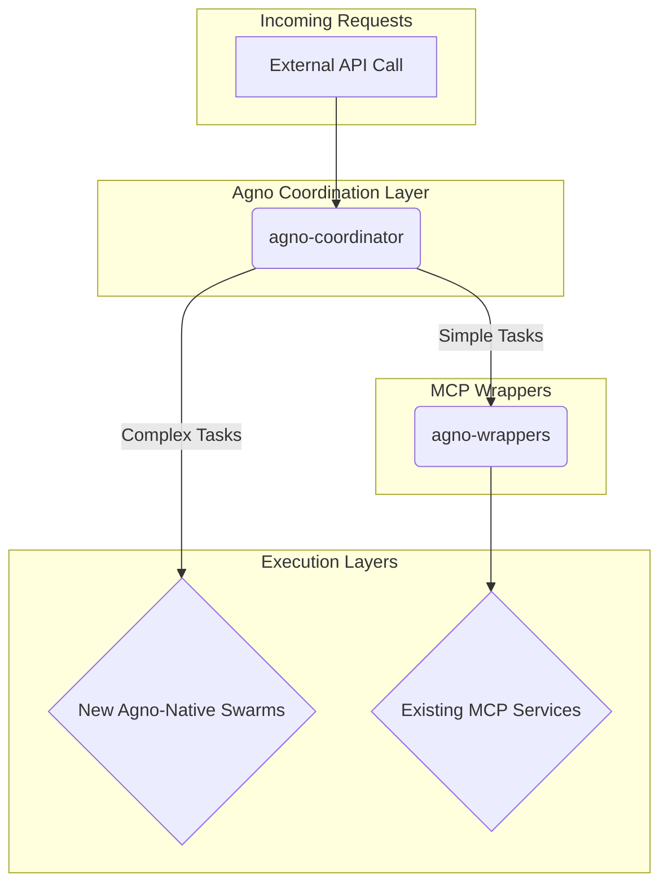

# Agno AI Integration Plan

**Author**: Roo, Technical Leader
**Date**: 2025-08-27
**Status**: Initial Reconnaissance complete. Awaiting approval to proceed with implementation.

## 1. Executive Summary

This document outlines the implementation plan for integrating Agno AI agent swarms into the `ai-cherry/sophia-ai-intel` monorepo. Initial reconnaissance has revealed that a significant amount of an "Agno" integration already exists within the repository.

Our investigation uncovered placeholder services, Kubernetes configurations, and detailed planning documents that describe a **hybrid integration strategy**. This strategy preserves existing MCP (Model Context Protocol) services while using Agno as an intelligent coordination and routing layer.

This plan embraces the existing architecture and outlines the next steps to bring the placeholder services to life. We will not be starting from scratch, but rather building upon the solid foundation that has already been established.

## 2. Key Findings

- **Existing `agno` Services**: The `services/` directory contains `agno-coordinator`, `agno-teams`, and `agno-wrappers`. These are placeholder services that establish a clear architectural intent. The `agno-coordinator` is a TypeScript/Express application, while the `agno-teams` and `agno-wrappers` are Python/FastAPI services.

- **Pre-existing Integration Plan**: The repository contains detailed documentation (`SOPHIA_AI_AGNO_INTEGRATION_ANALYSIS.md`, `SOPHIA_AI_COMPREHENSIVE_AGNO_INTEGRATION_PLAN.md`) outlining a hybrid approach. The core idea is to use an `agno-coordinator` to route requests to either new `agno`-native agent teams or to existing MCP services enhanced with `agno`-compatible wrappers.

- **No `phidata` Conflicts**: A repository-wide search confirmed that there is no existing work related to `phidata`, so we can proceed without concern for conflicts.

## 3. High-Level Architecture

The integration will follow the hybrid model discovered during reconnaissance.

## 4. Implementation Steps

The following steps will guide the implementation of the Agno integration.

### Phase 1: Implement the `agno-coordinator`

- **Goal**: Build out the routing logic in the `agno-coordinator` service.
- **Tasks**:
    - [ ] Implement the feature flag system for gradual rollout.
    - [ ] Implement the routing logic to decide between `agno`-native and MCP services.
    - [ ] Connect to Redis for caching and session management.

### Phase 2: Develop `agno-wrappers` for MCP Services

- **Goal**: Make existing MCP services compatible with the Agno framework.
- **Tasks**:
    - [ ] Create `AgnosticMCPAgent` base class in `services/agno-wrappers`.
    - [ ] Develop wrappers for high-priority MCP services (e.g., `mcp-agents`, `mcp-context`).
    - [ ] Implement the translation layer between Agno tasks and MCP API calls.

### Phase 3: Build the First Agno-Native Agent Swarm

- **Goal**: Create the first fully functional `agno` agent swarm.
- **Tasks**:
    - [ ] Develop the `agentic` service to host the new swarm.
    - [ ] Implement the business logic for the first swarm (e.g., a "research" swarm).
    - [ ] Integrate the new swarm with the `agno-coordinator`.

### Phase 4: Testing and Validation

- **Goal**: Ensure the integration is robust and reliable.
- **Tasks**:
    - [ ] Write unit tests for the `agno-coordinator`, `agno-wrappers`, and `agentic` service.
    - [ ] Create end-to-end integration tests that cover the entire workflow.
    - [ ] Perform load testing to validate performance and scalability.

## 5. Next Steps

This plan is ready for review and approval. Once approved, we will proceed with creating a detailed TODO list and begin implementation, starting with Phase 1.